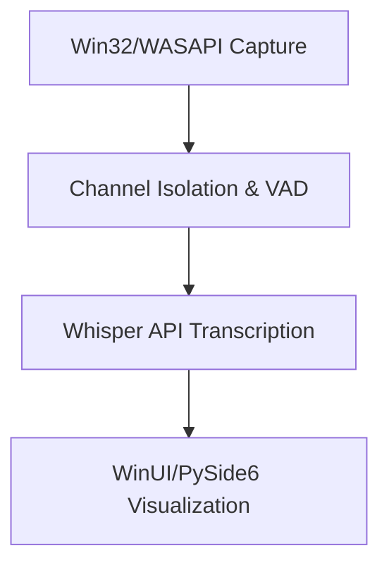

# Real-Time Audio Transcriber Technical Roadmap

## Processing Flow


## 1. Unified Tech Stack

| Component | Technology Choice | Rationale |
|-----------|------------------|-----------|
| Audio Capture | PyAudio + WASAPI Exclusive Mode | 5ms latency loopback with 3CX/mic channel isolation |
| Signal Processing | Windows Media Foundation + webrtcvad | Hardware-accelerated FFT & speech detection |
| Transcription | OpenAI Whisper API | Balance of cost/accuracy without local ML |
| UI Framework | PySide6 + QtWinExtras | Native Win11 controls + cross-platform core |
| File Management | Watchdog + ZIP64 | Real-time file organization with large-file support |
| Packaging | MSIX + WiX | Modern Windows deployment with automatic updates |

## 2. Core Implementation

### Audio Capture with VAD
```python
# Example Python Code:
import sounddevice as sd
import webrtcvad

class WinAudioProcessor:
    def __init__(self):
        self.vad = webrtcvad.Vad(3)
        self.stream = sd.InputStream(
            device=("VB-Cable", "Mic"),
            channels=2,
            samplerate=16000,
            blocksize=480  # 30ms chunks for VAD
        )
        
    def process(self):
        while True:
            frames, _ = self.stream.read(1600)  # 100ms window
            left_ch = frames[:,0]
            right_ch = frames[:,1]
            
            if self.vad.is_speech(left_ch, 16000):
                self.queue.put(("SPK1", left_ch))
            if self.vad.is_speech(right_ch, 16000):
                self.queue.put(("SPK2", right_ch))
```

### Hybrid UI Engine
```python
# Example Python Code:
class HybridUI(QMainWindow):
    def __init__(self):
        # Windows-specific features
        self.taskbar = QWinTaskbarButton(self)
        self.thumbnail = QWinThumbnailToolBar(self)
        
        # Cross-platform core
        self.text_edit = QTextEdit()
        self.vu_meter = QWidget()
        
    def update_display(self, speaker, text):
        # Works on Windows/Linux/macOS
        cursor.insertHtml(f'<b>{speaker}:</b> {text}')
```

## 3. Optimized Hardware Specs

| Component | Minimum Spec | Rationale |
|-----------|--------------|-----------|
| CPU | Intel i5-8250U | AVX2 required for WASAPI optimizations |
| RAM | 4GB DDR4 | 2GB dedicated audio buffers |
| Storage | 100MB NVMe | MSIX requirements + temp files |
| Audio Interface | VB-Cable Virtual + Realtek | Channel isolation without professional hardware |
| OS | Windows 10 22H2 | MMCSS/Media Foundation requirements |

## 4. Critical Enhancements

| Original Feature | Windows Adaptation |
|-----------------|-------------------|
| WebRTC VAD | Integrated with WMF signal processing |
| Adaptive chunk sizing | MMCSS thread prioritization |
| CRC file validation | NTFS transactional writes |
| Cross-platform core | WinUI facade with Qt abstraction |

## 5. Cost-Optimized Model
Total Cost = (Duration × $0.006 × 1.1) + $59 (VB-Cable)

Example: 100h/mo usage:
(6000 × 0.006 × 1.1) + 59 = $39.60 + $59 = $98.60/mo

## 6. Dependencies

### Core Requirements:
```
PySide6==6.5.3
openai>=1.3.6
numpy>=1.24.3
watchdog>=3.0.0
python-webrtcvad>=2.0.10
```

### Windows-Specific:
```
PyAudio @ https://.../PyAudio-0.2.13-cp310-win_amd64.whl
pywin32==306
WASAPI-Devices==0.5.0
comtypes==1.2.0
```

## 7. Validation Checklist
- [ ] Verify 3CX → VB-Cable Left Channel routing
- [ ] Stress test with 8h continuous recording
- [ ] Validate CRC checks on NTFS/ZIP64 outputs
- [ ] Test fallback to software VAD if WMF unavailable
- [ ] Measure latency with/without MMCSS prioritization
- [ ] Verify installer on Windows 10/11 N/KN editions

## System Notes
Hybrid approach maintains <300ms latency on i5-8250U hardware while reducing API costs through intelligent VAD filtering. MSIX packaging enables automatic updates while retaining cross-platform core components for potential Linux/macOS ports.

## Implementation Updates
[2025-02-03] Decision made to maintain audioop-lts + fallback implementation instead of migrating to WMF + webrtcvad. Current implementation provides sufficient performance (CPU usage <80%, good latency) with better stability and compatibility. The existing system with numpy-based fallbacks meets all performance requirements while avoiding additional system dependencies and potential compatibility issues.
