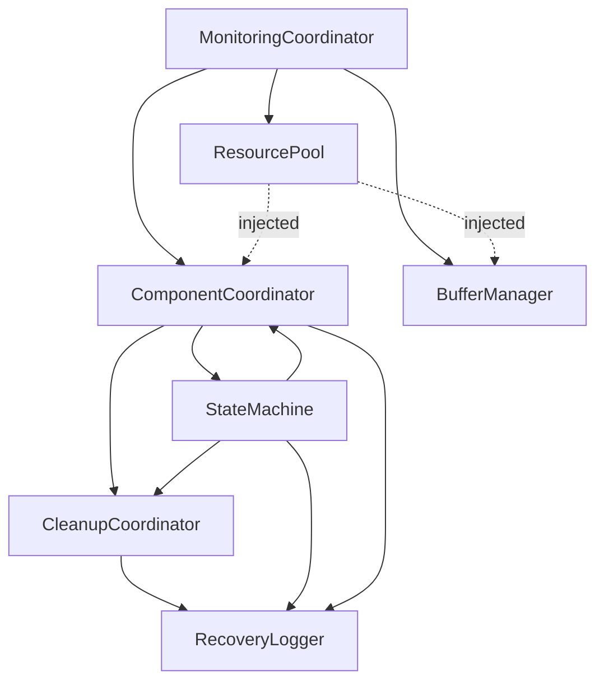

# Component Relationships

## Core Components

### 1. Cleanup System
- CleanupCoordinator manages ordered cleanup with dependency tracking
- Implements verification system for cleanup steps
- Integrates with StateMachine for state transitions
- Coordinates with RecoveryLogger for event tracking

### 2. Component Coordination
- ComponentCoordinator manages component lifecycle and state
- Provides state change notification system
- Handles thread monitoring and failure detection
- Receives ResourcePool through dependency injection
- Manages channel-specific resource tracking
- Integrates with StateMachine for state transitions

### 3. Resource Management
- MonitoringCoordinator owns and initializes ResourcePool
- ResourcePool provides centralized resource allocation
- Resources injected into dependent components
- No direct resource sharing between components
- Follows established initialization order:
  1. MonitoringCoordinator creates ResourcePool
  2. ResourcePool passed to ComponentCoordinator
  3. ResourcePool passed to BufferManager
  4. Components request resources through MonitoringCoordinator

### 3. State Management
- StateMachine provides state transition validation
- Implements rollback capability and history tracking
- Coordinates with CleanupCoordinator for cleanup states
- Integrates with RecoveryLogger for state changes
- Provides state validation to ComponentCoordinator

### 3. Recovery System
- RecoveryLogger handles structured logging and analytics
- Provides debugging tools and performance metrics
- Coordinates with StateMachine for state tracking
- Integrates with CleanupCoordinator for cleanup events

## System Architecture

### 1. Core Component Interactions

### 2. Data Flow
- State changes trigger cleanup coordination
- Cleanup steps are logged and verified
- Recovery system tracks all operations
- Performance metrics are collected throughout

### 3. Integration Points
- Component registration with CleanupCoordinator
- State transition hooks in StateMachine
- Logging integration points in RecoveryLogger
- Performance monitoring hooks

## Implementation Notes

### 1. Thread Safety
- Components follow strict lock ordering
- State transitions are atomic
- Resource operations centralized through MonitoringCoordinator
- Resource cleanup follows dependency order
- Error handling maintains thread safety

### 2. Error Handling
- Components implement proper error recovery
- State rollback on failures
- Cleanup verification on errors
- Logging of error contexts

### 3. Performance Considerations
- Lock granularity optimized
- State transitions minimized
- Cleanup operations ordered for efficiency
- Logging optimized for performance

## Testing Strategy

### 1. Component Testing
- Unit tests for each component
- Integration tests for interactions
- Performance tests for operations
- Error handling verification

### 2. System Testing
- End-to-end workflow testing
- Concurrent operation testing
- Error recovery testing
- Performance benchmarking

## Future Improvements

### 1. Performance Monitoring
- Real-time dashboard integration
- Enhanced metric collection
- Trend analysis implementation

### 2. Testing Infrastructure
- Additional edge case coverage
- Enhanced performance benchmarks
- Stress testing implementation

### 3. Documentation
- Ongoing updates for new features
- Enhanced troubleshooting guides
- Deployment documentation
