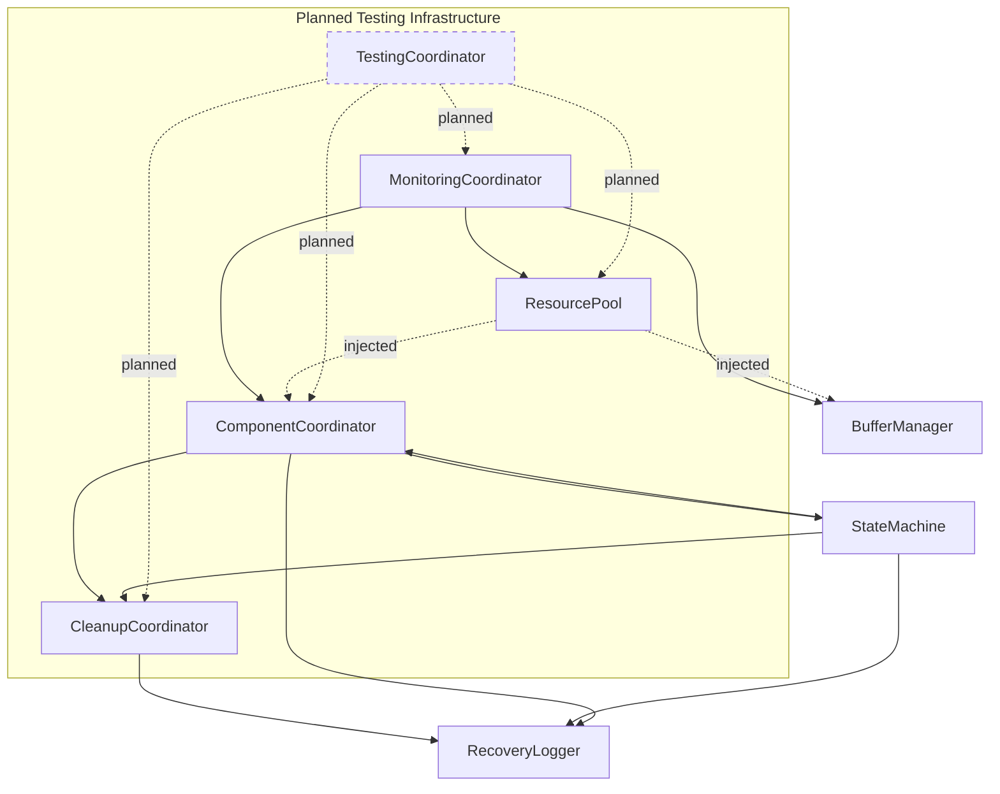

# Coordinator Dependencies Analysis

## 1. Core Architecture Overview

### 1.1 Current Architecture Issues (2025-02-20)

#### Circular Dependencies

1. Current Circular Dependencies
- MonitoringCoordinator → ComponentCoordinator (metrics collection)
- StateMachine → ComponentCoordinator (state transitions)
- ResourcePool → MonitoringCoordinator (resource metrics)
- Resource management separated from monitoring responsibilities
- Clear separation between monitoring and coordination interfaces
- Component state management decoupled from resource management

2. GUI Integration Dependencies
- MainWindow → MonitoringCoordinator (real-time updates)
- AlertSystem → QTimer (monitoring cycles)
- GUI Components → State Management (UI updates)
- Event-based notification system
- Clean separation of core logic
- Real-time visualization support

3. Recovery System Dependencies
- RecoveryLogger → MonitoringCoordinator (health tracking)
- RecoveryLogger → ComponentCoordinator (state recovery)
- Emergency Protocols → Resource Management (cleanup)
- Clear error propagation paths
- Proper error context preservation
- Enhanced recovery verification

4. Audio Processing Chain
- AudioCapture → SignalProcessor (buffer management)
- SignalProcessor → SpeakerIsolation (profile management)
- Channel Processing → Resource Management (allocation)
- Optimized buffer handling
- Clear resource ownership
- Enhanced performance tracking

5. Hardware Management
- DeviceManager → WASAPIMonitor (device states)
- TestingCoordinator → HardwareResourceManager (test devices)
- MonitoringCoordinator → DeviceVerifier (health checks)
- Proper device lifecycle management
- Clear resource cleanup
- Enhanced error handling

#### Potential Circular Dependencies
1. Test Infrastructure Dependencies
- ResourcePool → TestDataManager (test resources)
- MonitoringCoordinator → TestExecution (metrics)
- HardwareResourceManager → TestEnvironment (devices)

2. Testing Infrastructure Dependencies
   - TestingCoordinator → MonitoringCoordinator (test metrics/monitoring)
   - TestingCoordinator → ComponentCoordinator (test state management)
   - TestingCoordinator → CleanupCoordinator (test resource cleanup)
   - TestingCoordinator → ResourcePool (test resource allocation)
   - TestingCoordinator → TestEnvironment (test setup/teardown)
   - TestingCoordinator → TestDataManager (test data handling)
   - TestingCoordinator → TestMetrics (metrics collection)

3. Cleanup Dependencies
   - CleanupCoordinator → StateMachine (cleanup states)
   - CleanupCoordinator → MonitoringCoordinator (cleanup metrics)
   - CleanupCoordinator → ComponentCoordinator (component cleanup)

4. Processing Chain Dependencies
   - SignalProcessor → Transcriber (processing chain)
   - AudioCapture → WASAPIMonitor (device management)
   - SpeakerIsolation → WhisperTranscriber (speaker profiles)

5. Resource Management Dependencies
   - ResourcePool → BufferManager (resource allocation)
   - ResourcePool → StorageManager (buffer management)
   - ResourcePool → ComponentCoordinator (component resources)
   - Centralized resource management
   - Clear resource lifecycle
   - Enhanced monitoring capabilities

6. State Management Dependencies
   - MonitoringCoordinator → StateMachine (state metrics)
   - TestingCoordinator → ComponentState (test states)
   - CleanupCoordinator → RecoveryLogger (recovery states)
   - Clear state ownership
   - Enhanced state validation
   - Proper transition management

#### Mitigation Strategies

To manage these dependencies effectively, implement:

1. Interface-based Decoupling
   - Define clear interface boundaries between components
   - Implement dependency injection for all coordinators
   - Separate resource management from monitoring
   - Isolate state transitions from core logic
   - Abstract monitoring interfaces for testing
   - Create clean separation between GUI and core components
   - Implement channel-specific interfaces
   - Define clear API boundaries
   - Establish component isolation patterns
   - Create test-specific interfaces

2. Clear Responsibility Ownership
   - Assign explicit component ownership
   - Define complete resource lifecycles
   - Establish state management hierarchy
   - Document cleanup procedures
   - Specify error handling chains
   - Define test resource ownership
   - Establish monitoring boundaries
   - Create recovery ownership model
   - Define channel management roles
   - Specify test environment ownership

3. Lock Hierarchy Enforcement
   - Maintain strict lock ordering
   - Implement deadlock prevention
   - Define timeout management
   - Establish cleanup order
   - Coordinate state transitions
   - Handle test-specific locks
   - Manage resource locks
   - Control channel synchronization
   - Define recovery lock patterns
   - Implement test isolation locks

4. Resource Lifecycle Management
   - Define allocation patterns
   - Establish cleanup sequences
   - Handle error states properly
   - Track resource usage effectively
   - Monitor performance impact
   - Manage test resources
   - Control channel resources
   - Handle device resources
   - Manage memory pools
   - Track file handles

5. Error Propagation Chains
   - Define clear error paths
   - Establish recovery states
   - Handle cleanup failures
   - Track error patterns
   - Coordinate recovery procedures
   - Manage test failures
   - Handle device errors
   - Process API errors
   - Track channel errors
   - Monitor system health

6. State Transition Management
   - Define clear state paths
   - Implement validation checks
   - Handle rollback procedures
   - Track state history
   - Manage recovery states
   - Control test states
   - Handle device states
   - Process channel states
   - Monitor component states
   - Verify state consistency

7. Performance Optimization
   - Implement efficient resource usage
   - Optimize lock patterns
   - Minimize state transitions
   - Reduce error overhead
   - Optimize cleanup procedures
   - Enhance test performance
   - Improve channel processing
   - Optimize device handling
   - Reduce memory fragmentation
   - Enhance I/O operations

8. Testing Infrastructure
   - Implement comprehensive test coverage
   - Create isolation mechanisms
   - Define verification procedures
   - Establish monitoring systems
   - Track test metrics
   - Manage test resources
   - Handle test failures
   - Verify cleanup procedures
   - Monitor test performance
   - Generate test reports

#### Core Issues
1. State Management
   - Component states spread across multiple coordinators
   - Complex state transition validation
   - No clear ownership of state management
   - State change notifications tightly coupled
   - StateMachine has direct dependencies on coordinators
   - Recovery states tightly coupled with buffer management
   - Channel-specific states increase complexity
   - Resource validation mixed with state transitions
   - Test states not properly integrated with component states
   - Async state transitions not fully handled
   - State rollback during test failures needs coordination
   - Lock acquisition order during state transitions not verified

2. Async Operation Handling
   - No explicit examples of async error propagation in lock hierarchy
   - Missing guidance for async state transitions during test execution
   - Need examples of async resource cleanup coordination
   - Lack of async operation timeout handling in test scenarios
   - Async error context preservation incomplete
   - No standardized async operation patterns
   - Missing async operation cancellation handling
   - Incomplete async resource lifecycle management

3. Hardware Resource Management
   - No detailed examples of hardware resource cleanup in TestingCoordinator
   - Missing specifications for hardware test lab requirements
   - Incomplete guidance for handling hardware failures during tests
   - Need examples of device state verification in test scenarios
   - Hardware resource lifecycle not fully defined
   - Device state transition validation incomplete
   - Missing hardware error recovery procedures
   - No clear hardware resource ownership

4. Performance Monitoring
   - Missing examples of performance degradation detection
   - No threshold definitions for resource usage monitoring
   - Incomplete metrics collection for long-running tests
   - Need guidance for performance impact during concurrent operations
   - Performance baseline establishment unclear
   - Resource usage thresholds not standardized
   - Missing performance impact analysis
   - No clear performance regression detection

5. Channel Synchronization
   - Missing examples of multi-channel error recovery
   - Incomplete guidance for channel-specific resource limits
   - Need examples of channel state verification in tests
   - Lack of channel synchronization failure handling
   - Channel state corruption detection missing
   - No clear channel ownership model
   - Missing channel resource isolation
   - Incomplete channel cleanup procedures

6. Test Data Management
   - No standardized approach for test data generation
   - Missing examples of test data cleanup procedures
   - Incomplete guidance for test data isolation
   - Need examples of test data verification
   - Test data lifecycle not defined
   - Missing test data corruption detection
   - No clear test data ownership
   - Incomplete test data cleanup verification

7. Recovery Procedures
   - Missing examples of partial recovery scenarios
   - Incomplete guidance for recovery state verification
   - Need examples of recovery during concurrent operations
   - Lack of recovery procedure timeout handling
   - Recovery state corruption detection missing
   - No clear recovery ownership model
   - Incomplete recovery verification
   - Missing recovery metrics collection

8. Resource Pool Fragmentation
   - Missing examples of fragmentation detection
   - No guidance for fragmentation prevention
   - Incomplete cleanup procedures for fragmented pools
   - Need examples of pool optimization during long runs
   - Pool health monitoring incomplete
   - No clear fragmentation thresholds
   - Missing pool optimization metrics
   - Incomplete pool cleanup verification

9. Thread Safety
   - Missing examples of thread deadlock detection
   - Incomplete guidance for thread starvation prevention
   - Need examples of thread health verification
   - Lack of thread cleanup timeout handling
   - Thread state corruption detection missing
   - No clear thread ownership model
   - Missing thread resource isolation
   - Incomplete thread cleanup procedures

2. Resource Management
   - Mixed responsibilities between coordinators
   - Complex allocation/deallocation paths
   - Resource tracking spread across components
   - No centralized resource lifecycle
   - Test resource cleanup not properly integrated
   - Memory pool fragmentation during long test runs
   - Resource limits not enforced across test boundaries
   - Temporary test file management not standardized
   - Resource leak detection needs improvement

3. Error Handling
   - Error propagation paths unclear
   - Recovery procedures span multiple coordinators
   - Complex error state management
   - Inconsistent error reporting
   - Test failures not properly distinguished from system errors
   - Error context loss during async operations
   - Recovery procedures not verified in test scenarios
   - Error injection mechanisms not standardized
   - Thread failure handling incomplete

4. Testing Challenges
   - Components must be tested with real system interactions
   - No mocking allowed (except Whisper API during development)
   - Circular dependencies require real component instantiation
   - State verification must use actual state changes
   - Hardware dependencies require real device testing
   - Test environment setup/teardown not atomic
   - Resource cleanup between tests unreliable
   - Test isolation not guaranteed
   - Performance impact of real device tests
   - Test data generation not standardized
   - Hardware test lab requirements not specified
   - Long-running test stability issues
   - Test result aggregation incomplete

### 1.2 Recent Changes (2025-02-18/19)
- Lock Hierarchy Established:
  * Current order: state -> metrics -> perf -> component -> update
  * Must be preserved in interface implementations
  * Affects all component interactions
- State Management Evolution:
  * Channel-specific states implemented
  * Rollback mechanisms in place
  * Performance tracking integrated
- Resource Management Progress:
  * Tier-aware buffer optimization active
  * ResourcePool integration complete
  * Channel-specific queues implemented

## 2. Core Coordinator Analysis

### 2.1 Monitoring Coordinator
1. Current Dependencies
   - Direct dependencies on multiple core components:
     * ComponentCoordinator for state management
     * BufferManager for resource operations
     * ResourcePool for resource allocation
     * PySide6.QtCore for GUI signal handling
   - Complex lock hierarchy implementation:
     * State lock (RLock)
     * Metrics lock
     * Performance lock
     * Thread management locks
     * Component operation locks

2. Resource Management Issues
   - Complex resource pool configuration
   - Mixed responsibilities:
     * Buffer allocation/deallocation
     * Thread lifecycle management
     * Performance tracking
     * State coordination
   - Resource cleanup during shutdown
   - Channel-specific resource tracking

3. State Management Issues
   - Complex state transition handling
   - Error state propagation
   - Channel-specific state tracking
   - Thread state management
   - Component lifecycle coordination

4. Error Handling
   - Multi-level error tracking
   - Channel-aware error handling
   - Thread failure management
   - Error context preservation
   - Complex recovery procedures

5. Performance Tracking
   - Detailed metrics collection
   - Channel-specific metrics
   - Performance history management
   - Resource usage monitoring
   - Thread health tracking

### 2.2 Component Coordinator
1. Current Dependencies
   - Required MonitoringCoordinator in constructor
   - Complex state machine integration
   - Thread monitoring system
   - Lock hierarchy management:
     * Component operations
     * Resource operations
     * History operations
     * Callback operations
     * Thread monitoring

2. Resource Management Issues
   - Complex resource allocation tracking
   - Channel-specific buffer management
   - Mixed resource type handling
   - Component lifecycle management
   - Resource limit enforcement

3. State Management Issues
   - Complex state transition validation
   - State history tracking
   - Component state rollback
   - Thread state monitoring
   - Callback notification system

4. Error Handling
   - Thread failure management
   - Component error propagation
   - State transition errors
   - Resource allocation failures
   - Cleanup error handling

### 2.3 Testing Coordinator
1. Core Responsibilities
   - Test environment management
   - Real component interaction validation
   - Lock hierarchy enforcement
   - Resource cleanup coordination
   - Test result organization
   - Performance analysis

2. Dependencies
   - Direct MonitoringCoordinator dependency
   - ComponentCoordinator for state validation
   - ResourcePool for test resources
   - CleanupCoordinator for test cleanup
   - Lock hierarchy compliance:
     * State lock (RLock)
     * Metrics lock
     * Performance lock
     * Component lock
     * Update lock

3. Resource Management
   - Test environment setup/teardown
   - Real component allocation
   - Test file management
   - Result directory organization
   - Resource usage monitoring

4. State Management
   - Test state tracking
   - Component state validation
   - Lock state verification
   - Thread health monitoring
   - Error state handling

5. Implementation Example
```python
class TestingCoordinator:
    """Coordinator for managing test execution and validation."""
    
    def __init__(
        self,
        monitoring_coordinator: MonitoringCoordinator,
        component_coordinator: ComponentCoordinator,
        cleanup_coordinator: CleanupCoordinator
    ):
        self.monitoring = monitoring_coordinator
        self.component = component_coordinator
        self.cleanup = cleanup_coordinator
        self.locks = self._create_lock_hierarchy()
        self.test_env = TestEnvironment()
        
    def _create_lock_hierarchy(self) -> Dict[str, threading.RLock]:
        """Create locks following hierarchy: state -> metrics -> perf -> component -> update"""
        return {
            "state": threading.RLock(),
            "metrics": threading.RLock(),
            "perf": threading.RLock(),
            "component": threading.RLock(),
            "update": threading.RLock()
        }
        
    async def setup_test_environment(self) -> None:
        """Initialize test environment with real components."""
        with self.locks["state"]:
            self.test_env.initialize_managers()
            
        with self.locks["metrics"], self.locks["perf"]:
            await self._verify_system_health()
            
    async def run_component_test(
        self,
        component: str,
        test_data: bytes,
        expected_state: ComponentState
    ) -> None:
        """Execute component test with proper lock management."""
        thread_id = self.monitoring.register_thread()
        try:
            with self.locks["state"]:
                current_state = self.component.get_component_state(component)
                if current_state != ComponentState.INITIALIZED:
                    raise TestError(f"Invalid initial state: {current_state}")
            
            with self.locks["metrics"], self.locks["perf"]:
                # Process test data with real component
                for channel in ["left", "right"]:
                    with self.locks["component"]:
                        result = await self._process_channel(component, channel, test_data)
                        
                    with self.locks["update"]:
                        self._update_test_metrics(component, channel, result)
                        
            # Verify final state
            with self.locks["state"]:
                final_state = self.component.get_component_state(component)
                if final_state != expected_state:
                    raise TestError(f"Invalid final state: {final_state}")
                    
        except Exception as e:
            self._handle_test_error(e, thread_id)
        finally:
            self.monitoring.unregister_thread(thread_id)
            
    async def cleanup_test_environment(self) -> None:
        """Cleanup test environment in reverse dependency order."""
        try:
            with (
                self.locks["state"],
                self.locks["metrics"],
                self.locks["perf"],
                self.locks["component"],
                self.locks["update"]
            ):
                await self.test_env.cleanup_managers()
                self._verify_resource_cleanup()
                
        except Exception as e:
            raise TestError(f"Cleanup failed: {e}")
            
    def _handle_test_error(self, error: Exception, thread_id: int) -> None:
        """Handle test errors with proper context preservation."""
        error_context = {
            "thread_id": thread_id,
            "thread_health": self.monitoring.get_thread_health(thread_id),
            "system_health": self.monitoring.verify_system_health(),
            "lock_state": self._get_lock_state()
        }
        raise TestError(f"Test failed: {error}\nContext: {error_context}")
        
    def _verify_resource_cleanup(self) -> None:
        """Verify all test resources are properly cleaned up."""
        resources = self.monitoring.get_resource_usage()
        if resources["allocated_count"] > 0:
            raise TestError(f"Resource leak detected: {resources}")
            
    async def _verify_system_health(self) -> None:
        """Verify system health before test execution."""
        health = await self.monitoring.verify_system_health()
        if not health["status"] == "healthy":
            raise TestError(f"Unhealthy system state: {health}")
            
    def _get_lock_state(self) -> Dict[str, bool]:
        """Get current lock state for all managed locks."""
        return {name: lock.locked() for name, lock in self.locks.items()}
```

### 2.4 Cleanup Coordinator
1. State Integration
   - Direct dependency on StateMachine
   - Maps cleanup phases to recovery states
   - Complex state transition validation
   - Tightly coupled phase/state mapping
   - Requires monitoring coordinator for error handling

2. Cleanup Management
   - Ordered cleanup with dependency tracking
   - Complex step validation and verification
   - Async and sync cleanup operations
   - Multi-phase cleanup process
   - Resource cleanup coordination

3. Lock Management
   - Complex lock hierarchy (4 levels)
   - Lock ordering matches MonitoringCoordinator
   - Multiple critical sections
   - Potential deadlock scenarios
   - Cleanup requires multiple locks

4. Error Handling
   - Step failure propagation
   - Dependent step failure tracking
   - Error context preservation
   - Recovery state coordination
   - Complex error reporting chain

## 3. Resource Management Components

### 3.1 Buffer Manager
1. Queue Management
   - Channel-specific queues (left/right) increase complexity
   - Queue metrics tightly coupled with monitoring
   - Buffer allocation through coordinator
   - Complex cleanup coordination
   - Performance tracking mixed with buffer operations
   - Test data queues not isolated
   - Queue state verification incomplete
   - Buffer overflow during long tests
   - Channel synchronization issues
   - Missing queue health metrics

2. Lock Hierarchy
   - Multiple lock types for different operations
   - Lock ordering matches MonitoringCoordinator
   - Complex lock acquisition patterns
   - Potential deadlock scenarios
   - Cleanup requires multiple locks
   - Test-specific lock timeouts needed
   - Lock contention during parallel tests
   - Missing deadlock detection
   - Lock state verification gaps
   - Recovery lock handling incomplete

3. Resource Management
   - Buffer pools managed through coordinator
   - Resource limits checked through coordinator
   - Complex allocation/deallocation paths
   - Channel-aware resource tracking
   - Performance impact from validation chains
   - Test buffer isolation missing
   - Resource limit verification gaps
   - Memory fragmentation in test pools
   - Buffer lifecycle tracking issues
   - Resource leak detection needed

4. Error Handling
   - Error context preserved across operations
   - Complex rollback procedures
   - Multi-component error propagation
   - Channel-specific error tracking
   - Recovery requires coordinator interaction
   - Test failure isolation needed
   - Error state corruption issues
   - Incomplete cleanup after failures
   - Missing error context in tests
   - Recovery verification gaps

5. Test Integration (Planned)
   - Dedicated test buffer pools
   - Isolated test queues per component
   - Resource limit enforcement
   - Lock timeout configuration
   - Error context preservation
   - State verification mechanisms
   - Performance impact monitoring
   - Cleanup verification
   - Memory leak detection
   - Queue health tracking

### 3.2 Resource Pool
1. Current Dependencies
   - Direct MonitoringCoordinator constructor dependency
   - Extensive coordinator integration for metrics/errors
   - Follows coordinator's lock hierarchy
   - Heavy reliance on coordinator state updates
   - Potential circular dependency with planned TestingCoordinator

2. Resource Management Issues
   - Mixed responsibilities with monitoring
   - Complex allocation/tracking paths
   - No clear resource lifecycle ownership
   - Performance impact from validation chains
   - Tightly coupled cleanup procedures
   - Resource pool fragmentation during long test runs
   - Memory leaks during test failures
   - Resource limits not enforced across test boundaries
   - No standardized cleanup for test resources
   - Missing resource usage tracking per test

3. Metrics and State Issues
   - Metrics collection mixed with core logic
   - Complex state update procedures
   - No clear metrics ownership
   - Performance tracking tightly coupled
   - State transitions span components
   - Test-specific metrics not isolated
   - Resource state verification incomplete
   - Missing performance impact tracking
   - No clear test resource boundaries
   - State corruption during test failures

4. Error Handling Challenges
   - Complex error propagation paths
   - Multi-component error handling
   - Recovery procedures span systems
   - No clear error ownership
   - Mixed cleanup and error states
   - Test failures not properly isolated
   - Resource leaks during error recovery
   - Incomplete cleanup after test failures
   - Error context loss during cleanup
   - No clear distinction between test and system errors

5. Test Resource Management (Planned)
   - Dedicated test resource pools needed
   - Isolation between test runs required
   - Resource usage tracking per test
   - Cleanup verification mechanisms
   - Performance impact monitoring
   - Memory fragmentation handling
   - Resource limit enforcement
   - State corruption prevention
   - Error recovery procedures
   - Metrics collection isolation

### 3.3 Storage Manager
1. Current Dependencies
   - Direct MonitoringCoordinator dependency in constructor
   - StateMachine obtained through coordinator
   - RecoveryState enum from coordinator
   - Resource pool integration for buffers
   - Complex coordinator integration for:
     * Error handling
     * State management
     * Resource allocation
     * Performance tracking
     * Lock hierarchy

2. Resource Management Issues
   - Write buffers managed through coordinator
   - Complex buffer lifecycle tracking
   - Mixed buffer and state management
   - Performance impact from validation
   - No clear resource ownership

3. State Management Challenges
   - Complex state transition logic
   - State machine callback system
   - Recovery states tightly coupled
   - Mixed state and error handling
   - Coordinator-dependent state updates

4. Error Handling Complexity
   - Multiple error propagation paths
   - Complex recovery procedures
   - Emergency backup protocol
   - Mixed error and state handling
   - Coordinator-dependent error reporting

5. Implementation Impact
   - Needs interface-based constructor injection
   - Should implement IResourceManager interface
   - Requires separation of:
     * Resource management from I/O operations
     * State management from core logic
     * Error handling through dedicated interface
     * Performance tracking from storage operations

## 4. Processing Components

### 4.1 Signal Processor
1. Current Dependencies
   - Direct MonitoringCoordinator dependency in constructor
   - Optional Transcriber dependency
   - Complex resource allocation through coordinator
   - Heavy reliance on coordinator for:
     * Resource management
     * Error handling
     * Performance tracking
     * State updates
     * Lock management

2. Resource Management Issues
   - Buffer allocation/deallocation through coordinator
   - Complex memory management with multiple thresholds
   - Tiered cleanup system (emergency/hard/soft/gc)
   - Performance impact from validation chains
   - No clear separation of resource concerns

3. Performance Monitoring
   - Tightly coupled metrics collection
   - Complex state tracking across components
   - Mixed responsibilities in monitoring
   - Direct coordinator updates for all metrics
   - No clear metrics ownership

4. Error Handling Challenges
   - Complex error propagation paths
   - Multiple fallback mechanisms
   - Recovery procedures span components
   - Mixed error and state management
   - Coordinator-dependent error reporting

5. Implementation Impact
   - Needs interface-based constructor injection
   - Should implement IResourceManager interface
   - Requires separation of:
     * Resource management from processing logic
     * Metrics collection from core operations
     * Error handling through dedicated interface
     * State management from processing operations

### 4.2 Audio Capture
1. Current Dependencies
   - Direct MonitoringCoordinator dependency in constructor
   - Gets BufferManager through coordinator
   - Gets WASAPIMonitor through coordinator
   - Complex coordinator integration for:
     * Device management
     * Error handling
     * State updates
     * Performance tracking
     * Buffer health monitoring

2. Resource Management Issues
   - Buffer operations through multiple managers
   - Complex channel separation handling
   - Mixed buffer and device management
   - Performance impact from health checks
   - No clear ownership of device resources

3. State Management Issues
   - Device states spread across components
   - Complex stream health tracking
   - Mixed buffer and stream states
   - Recovery state management
   - Channel-specific state tracking

4. Error Handling
   - Multiple error propagation paths
   - Complex device failure recovery
   - Mixed stream and buffer errors
   - Channel-specific error handling
   - Device change error management

### 4.3 Speaker Isolation
1. Current Dependencies
   - Optional MonitoringCoordinator in constructor
   - Heavy resource allocation through coordinator
   - Complex buffer management for:
     * Channel separation
     * Speech segments
     * FFT processing
     * Speaker profiles
   - Thread registration/cleanup integration

2. Resource Management Issues
   - Multiple buffer allocations per operation
   - Complex cleanup requirements
   - Mixed buffer and profile management
   - No clear ownership of FFT resources
   - Manual resource release patterns

3. State Management Issues
   - Speaker profiles spread across instances
   - Complex segment state tracking
   - No clear profile ownership
   - Mixed buffer and profile states
   - Thread state management

4. Error Handling
   - Multiple error propagation paths
   - Complex resource cleanup on errors
   - Mixed profile and buffer errors
   - Channel-specific error handling
   - FFT processing error management

### 4.4 Whisper Transcriber
1. Current Dependencies
   - Required MonitoringCoordinator in constructor
   - Direct SpeakerIsolation dependency
   - External OpenAI API integration
   - Complex coordinator integration for:
     * Error handling
     * Resource management
     * Performance tracking
     * Speaker tracking

2. Resource Management Issues
   - Mixed API and local resource handling
   - Complex speaker history management
   - No clear cleanup procedures
   - Rate limiting state management
   - Memory management for histories

3. State Management Issues
   - Complex initialization states
   - Mixed API and local states
   - Speaker profile coordination
   - Error state tracking
   - Performance state management

4. Error Handling
   - Multiple error propagation paths
   - Complex API error handling
   - Mixed local and API errors
   - Consecutive error tracking
   - Rate limit error management

## 5. Support Components

### 5.1 Alert System
1. Current Dependencies
   - Tightly coupled to MonitoringCoordinator for:
     * System metrics collection
     * Thread registration and lifecycle
     * Component locking mechanisms
     * Error handling and propagation
     * Alert suppression logic
     * Performance tracking
   - Complex state management across coordinators
   - Intertwined resource and monitoring operations

### 5.2 System Verifier
1. Current Dependencies
   - Direct MonitoringCoordinator instantiation
   - Direct dependencies on multiple components:
     * WASAPIMonitor
     * CleanupCoordinator
     * RecoveryLogger
     * StateMachine
     * StorageManager
     * DeviceManager
   - Complex initialization chain
   - Potential circular dependency with planned TestingCoordinator

2. Resource Management Issues
   - Multiple component lifecycles
   - Mixed verification responsibilities
   - No clear cleanup ordering
   - Test file management
   - Device resource handling
   - Test environment isolation missing
   - Resource limit verification gaps
   - Hardware resource tracking incomplete
   - Test data persistence issues
   - Cleanup verification needed

3. State Management Issues
   - Complex state verification
   - Mixed component states
   - Recovery state tracking
   - Test result management
   - Device state validation
   - Test state corruption handling
   - State transition verification
   - Recovery state coordination
   - Test boundary state issues
   - Hardware state verification

4. Error Handling
   - Multiple component error paths
   - Complex recovery verification
   - Mixed error reporting
   - Test failure management
   - Device error handling
   - Test error isolation needed
   - Error context preservation
   - Recovery procedure validation
   - Hardware error simulation
   - Test failure analysis

5. Test Environment Management (Planned)
   - Hardware test lab setup
   - Resource isolation mechanisms
   - State verification procedures
   - Error injection framework
   - Performance monitoring
   - Test data generation
   - Result aggregation
   - Environment cleanup
   - Hardware simulation
   - Test metrics collection

### 5.3 WASAPI Monitor
1. Current Dependencies
   - Required MonitoringCoordinator in constructor
   - Direct StateMachine dependency
   - Complex coordinator integration for:
     * Thread registration
     * State management
     * Error handling
     * Buffer management
     * Resource cleanup

2. Resource Management Issues
   - Complex stream lifecycle management
   - Multiple lock hierarchies
   - Mixed device and stream handling
   - PyAudio resource management
   - Buffer allocation coordination

3. State Management Issues
   - Complex state machine integration
   - Device state tracking
   - Stream health monitoring
   - Recovery state coordination
   - Callback state management

4. Error Handling
   - Multi-level recovery system
   - Complex device error handling
   - Stream failure recovery
   - Circuit breaker pattern
   - Buffer health monitoring

### 5.4 Windows Manager
1. Current Dependencies
   - Minimal external dependencies
   - Direct RecoveryLogger integration
   - Windows API integrations:
     * Registry access
     * Service management
     * Process control
     * MMCSS configuration
   - Complex fallback system

2. Resource Management Issues
   - Service cache management
   - Process priority handling
   - MMCSS resource control
   - API fallback resources
   - No clear cleanup patterns

3. State Management Issues
   - Version state tracking
   - API compatibility states
   - Service status tracking
   - Fallback state management
   - Error state handling

4. Error Handling
   - Multiple fallback mechanisms
   - Service access errors
   - API compatibility errors
   - MMCSS configuration errors
   - Windows version detection errors

### 5.5 Recovery Logger
1. Current Dependencies
   - Minimal external dependencies:
     * aiofiles for async I/O
     * psutil for system metrics
     * statistics for analytics
     * json for data serialization
   - File system integration:
     * Log directory structure
     * Analytics storage
     * Debug information
     * Session management
   - Planned TestingCoordinator integration

2. Resource Management
   - Async file I/O operations
   - Log file lifecycle management
   - Analytics cache handling
   - Session state tracking
   - System resource monitoring
   - Test result persistence
   - Log file isolation per test
   - Resource usage tracking
   - Cleanup coordination
   - Storage optimization

3. State Management
   - Recovery attempt tracking
   - Session lifecycle handling
   - State transition analysis
   - System state capture
   - Analytics state management
   - Test state persistence
   - Recovery state validation
   - State history tracking
   - Test boundary handling
   - State corruption prevention

4. Error Handling
   - File operation error handling
   - Analytics calculation fallbacks
   - System state capture errors
   - Log cleanup error management
   - Session state validation
   - Test failure logging
   - Error context preservation
   - Recovery verification
   - Error pattern analysis
   - Failure prediction

5. Performance Considerations
   - Async I/O for minimal blocking
   - Efficient analytics caching
   - Optimized log rotation
   - Resource usage tracking
   - Statistical analysis optimization
   - Test impact monitoring
   - Performance regression detection
   - Resource consumption analysis
   - Long-term trend tracking
   - Hardware utilization metrics

6. Test Integration (Planned)
   - Test result aggregation
   - Performance analysis
   - Error pattern detection
   - Resource usage tracking
   - State transition validation
   - Recovery success rates
   - Test coverage metrics
   - Hardware compatibility
   - System stability analysis
   - Long-term reliability tracking

## 6. Application Components

### 6.1 Audio Transcriber
1. Current Dependencies
   - Direct MonitoringCoordinator instantiation
   - Direct CleanupCoordinator instantiation
   - Multiple component dependencies:
     * WindowsManager
     * AdaptiveAudioCapture
     * SignalProcessor
     * StorageManager
     * WhisperTranscriber
   - Complex initialization chain

2. Resource Management Issues
   - Multiple component lifecycle management
   - Complex resource limit tracking
   - Mixed cleanup responsibilities
   - Performance stats management
   - Directory structure handling

3. State Management Issues
   - Complex system health tracking
   - Multi-component state coordination
   - Recovery state management
   - Initialization state handling
   - Cleanup state tracking

4. Error Handling
   - Multi-level recovery system
   - Complex rollback procedures
   - Component-specific error handling
   - Resource limit violations
   - Coordinated cleanup on errors

### 6.2 Main Application
1. Current Dependencies
   - Core system initialization:
     * MonitoringCoordinator
     * AlertSystem with AlertConfig
     * StorageManager
     * WhisperTranscriber
     * BufferManager
     * WASAPIMonitor
     * AudioCapture
     * SignalProcessor
   - GUI components:
     * PySide6 QApplication
     * MainWindow
     * QTimer for monitoring
   - Planned test infrastructure:
     * TestingCoordinator
     * TestEnvironment
     * TestExecution
     * TestMetrics
     * TestResults

2. Initialization Management
   - Complex component initialization order
   - Circular dependency resolution
   - Async initialization chain
   - Component registration sequence
   - Mock configuration handling
   - Test environment setup
   - Resource isolation
   - State verification
   - Hardware detection
   - Performance baseline

3. Resource Management
   - Working directory configuration
   - Component lifecycle tracking
   - Proper cleanup sequence
   - Lock hierarchy preservation
   - Resource release coordination
   - Test resource isolation
   - Memory pool management
   - File handle tracking
   - Hardware resource allocation
   - Performance monitoring

4. Error Handling
   - Multi-level error reporting
   - Component-specific cleanup
   - Initialization failure handling
   - Fatal error management
   - Coordinator error integration
   - Test failure isolation
   - Error context preservation
   - Recovery verification
   - State rollback
   - System stability

5. Test Infrastructure Integration (Planned)
   - Test environment initialization
   - Resource isolation mechanisms
   - State verification procedures
   - Error injection framework
   - Performance monitoring
   - Test data generation
   - Result aggregation
   - Environment cleanup
   - Hardware simulation
   - Test metrics collection

## 7. Interface Definitions

### 7.1 Core Management Interfaces

```python
IStateManager:
- register_component(name: str, component_type: str)
- get_component_state(component: str)
- transition_component_state(component: str, new_state: ComponentState)
- register_state_callback(callback: Callable)
- verify_state_consistency() -> bool  # Added for test validation
- get_state_history() -> List[StateEvent]  # Added for test analysis
- verify_state_rollback() -> bool  # Added for test recovery
- get_state_metrics() -> Dict[str, Any]  # Added for test analysis

IMonitoringManager:
- start_monitoring()
- stop_monitoring()
- update_metrics(**kwargs)
- verify_system_health() -> bool
- start_test_monitoring(test_name: str) -> None  # Added for test monitoring
- stop_test_monitoring(test_name: str) -> None  # Added for test monitoring
- get_test_metrics(test_name: str) -> Dict[str, Any]  # Added for test analysis
- verify_test_health(test_name: str) -> bool  # Added for test validation

IThreadManager:
- register_thread() -> int
- unregister_thread(thread_id: Optional[int])
- handle_thread_failure(thread_id: int, thread_name: str)
- get_thread_health(thread_id: int) -> Dict[str, Any]
- register_test_thread(test_name: str) -> int  # Added for test thread management
- unregister_test_thread(test_name: str, thread_id: int) -> None  # Added for test cleanup
- verify_test_threads(test_name: str) -> bool  # Added for test validation
- get_test_thread_metrics(test_name: str) -> Dict[str, Any]  # Added for test analysis

ITestManager:  # New interface for test management
- register_test(test_name: str, test_type: str) -> None
- start_test(test_name: str) -> None
- stop_test(test_name: str) -> None
- get_test_state(test_name: str) -> TestState
- verify_test_health(test_name: str) -> bool
- get_test_metrics(test_name: str) -> Dict[str, Any]
- verify_test_cleanup(test_name: str) -> bool
- get_test_history() -> List[TestEvent]

ITestResourceManager:  # New interface for test resource management
- allocate_test_resource(test_name: str, resource_type: str, size: int) -> Any
- release_test_resource(test_name: str, resource_type: str, resource: Any) -> None
- verify_test_resources(test_name: str) -> bool
- get_test_resource_metrics(test_name: str) -> Dict[str, Any]
- cleanup_test_resources(test_name: str) -> None
- verify_resource_isolation() -> bool

ITestStateManager:  # New interface for test state management
- register_test_state(test_name: str, initial_state: TestState) -> None
- transition_test_state(test_name: str, new_state: TestState) -> bool
- get_test_state_history(test_name: str) -> List[TestStateEvent]
- verify_test_state(test_name: str) -> bool
- rollback_test_state(test_name: str) -> bool
- get_test_state_metrics(test_name: str) -> Dict[str, Any]
```

### 7.2 Resource Management Interfaces

```python
IResourceManager:
- allocate_resource(component: str, resource_type: str, size: int)
- release_resource(component: str, resource_type: str, resource: Any)
- get_allocated_count() -> int
- verify_resource_limits() -> bool  # Added for test validation
- get_resource_metrics() -> Dict[str, Any]  # Added for test analysis
- verify_resource_cleanup() -> bool  # Added for test validation
- get_resource_history() -> List[ResourceEvent]  # Added for test analysis

IBufferManager:
- put_buffer(component: str, data: bytes, timeout: float) -> bool
- get_buffer(component: str, timeout: float) -> Optional[bytes]
- get_buffer_config() -> BufferConfig
- update_buffer_config(**kwargs) -> None
- optimize_buffers() -> None
- get_performance_stats() -> Dict[str, Any]
- verify_buffer_health() -> bool  # Added for test validation
- get_buffer_metrics() -> Dict[str, Any]  # Added for test analysis
- verify_buffer_cleanup() -> bool  # Added for test validation
- get_buffer_history() -> List[BufferEvent]  # Added for test analysis

IQueueManager:
- get_queue_size(queue_name: str) -> int
- get_queue_metrics() -> Dict[str, Any]
- validate_queue_state() -> bool
- cleanup_queues() -> bool
- verify_queue_health() -> bool  # Added for test validation
- get_queue_history() -> List[QueueEvent]  # Added for test analysis
- verify_queue_cleanup() -> bool  # Added for test validation
- get_queue_metrics_history() -> List[QueueMetrics]  # Added for test analysis

ITestResourcePool:  # New interface for test resource pooling
- allocate_test_pool(test_name: str, pool_type: str, size: int) -> None
- release_test_pool(test_name: str, pool_type: str) -> None
- get_pool_metrics(test_name: str) -> Dict[str, Any]
- verify_pool_health(test_name: str) -> bool
- cleanup_test_pools() -> None
- verify_pool_isolation() -> bool
- get_pool_history() -> List[PoolEvent]

ITestBufferManager:  # New interface for test buffer management
- create_test_buffer(test_name: str, size: int) -> None
- release_test_buffer(test_name: str) -> None
- get_buffer_state(test_name: str) -> Dict[str, Any]
- verify_buffer_isolation() -> bool
- cleanup_test_buffers() -> None
- get_buffer_metrics() -> Dict[str, Any]

ITestQueueManager:  # New interface for test queue management
- create_test_queue(test_name: str, queue_type: str) -> None
- release_test_queue(test_name: str) -> None
- get_queue_state(test_name: str) -> Dict[str, Any]
- verify_queue_isolation() -> bool
- cleanup_test_queues() -> None
- get_queue_metrics() -> Dict[str, Any]
```

### 7.3 State and Cleanup Interfaces

```python
IStateMachine:
- transition_to(new_state: State) -> bool
- get_current_state() -> State
- register_state_change_callback(callback: Callable)
- validate_transition(from_state: State, to_state: State) -> bool
- get_state_history() -> List[StateEvent]
- verify_state_consistency() -> bool  # Added for test validation
- get_state_dependencies() -> Dict[State, Set[State]]  # Added for test planning
- verify_state_rollback() -> bool  # Added for test recovery
- get_state_metrics() -> Dict[str, Any]  # Added for test analysis

ICleanupManager:
- register_step(name: str, cleanup_fn: Callable, dependencies: List[str]) -> None
- execute_cleanup() -> bool
- get_cleanup_status() -> Dict[str, Any]
- get_execution_order() -> List[str]
- request_shutdown() -> None
- verify_cleanup_completion() -> bool  # Added for test validation
- get_cleanup_metrics() -> Dict[str, Any]  # Added for test analysis
- verify_resource_cleanup() -> bool  # Added for test validation
- get_cleanup_history() -> List[CleanupEvent]  # Added for test analysis

ICleanupStep:
- execute() -> bool
- verify() -> bool
- get_dependencies() -> Set[str]
- get_status() -> Dict[str, Any]
- get_execution_time() -> float  # Added for performance tracking
- get_resource_usage() -> Dict[str, Any]  # Added for resource monitoring
- verify_step_completion() -> bool  # Added for test validation
- get_step_metrics() -> Dict[str, Any]  # Added for test analysis

ITestEnvironment:  # New interface for test environment management
- initialize() -> None
- cleanup() -> None
- verify_health() -> bool
- get_metrics() -> Dict[str, Any]
- get_resource_state() -> Dict[str, Any]
- get_lock_state() -> Dict[str, bool]
- verify_cleanup() -> bool
- setup_test_resources() -> None  # Added for resource management
- cleanup_test_resources() -> None  # Added for resource cleanup
- verify_resource_isolation() -> bool  # Added for test validation
- get_environment_metrics() -> Dict[str, Any]  # Added for test analysis

ITestExecution:  # New interface for test execution management
- setup_test(test_name: str) -> None
- run_test(test_data: Any) -> None
- verify_result(expected: Any) -> bool
- cleanup_test() -> None
- get_test_metrics() -> Dict[str, Any]
- get_error_context() -> Dict[str, Any]
- verify_test_isolation() -> bool  # Added for test validation
- get_performance_metrics() -> Dict[str, Any]  # Added for test analysis
- verify_resource_cleanup() -> bool  # Added for test validation
- get_test_history() -> List[TestEvent]  # Added for test analysis

ITestResourceManager:  # New interface for test resource management
- allocate_test_resource(test_name: str, resource_type: str, size: int) -> Any
- release_test_resource(test_name: str, resource_type: str, resource: Any) -> None
- get_test_resource_usage(test_name: str) -> Dict[str, Any]
- verify_resource_limits(test_name: str) -> bool
- cleanup_test_resources(test_name: str) -> None
- get_resource_metrics() -> Dict[str, Any]
- verify_resource_isolation() -> bool
- get_resource_history() -> List[ResourceEvent]

ITestMetricsCollector:  # New interface for test metrics collection
- start_collection(test_name: str) -> None
- stop_collection(test_name: str) -> None
- record_metric(test_name: str, metric_name: str, value: Any) -> None
- get_test_metrics(test_name: str) -> Dict[str, Any]
- get_aggregated_metrics() -> Dict[str, Any]
- verify_performance_thresholds() -> bool
- get_metrics_history() -> List[MetricEvent]
- export_metrics(format: str) -> str

ITestResultAggregator:  # New interface for test result aggregation
- add_test_result(test_name: str, result: TestResult) -> None
- get_test_results() -> Dict[str, TestResult]
- get_failure_analysis() -> Dict[str, Any]
- get_coverage_report() -> Dict[str, Any]
- get_performance_summary() -> Dict[str, Any]
- export_results(format: str) -> str
- verify_test_requirements() -> bool
- get_result_history() -> List[ResultEvent]
```

## 8. Core Component Interactions

### 8.1 Dependency Flow


Note: The TestingCoordinator and its dependencies (shown with dashed lines) represent planned additions to the system. This coordinator will integrate with existing components to provide comprehensive test management while maintaining our no-mocking policy.

### 8.2 Implementation Status and Interface Integration
IMPORTANT: NO MOCKING POLICY
All components must use real system interactions. The only exception is WhisperTranscriber's OpenAI API calls during development.

Critical Components:
- audio_capture.py: Complete with real device interactions
- audio_transcriber.py: Complete with real audio processing
- buffer_manager.py: Updated with real tier-aware optimization, channel-specific queues
- signal_processor.py: Complete with real ResourcePool integration
- speaker_isolation.py: Real ResourcePool integrated
- wasapi_monitor.py: Complete with real WASAPI device handling

Support Components:
- alert_system.py: Complete with real system monitoring
- cleanup_coordinator.py: Enhanced with real state transitions and recovery
- monitoring_coordinator.py: Complete with real lock hierarchy updates
- resource_pool.py: Complete with real memory pools (4KB/64KB/1MB)

GUI Components:
- Native features in development with real-time updates

Interface Implementation:
- MonitoringCoordinator implements real IResourceManager, IMonitoringManager, IThreadManager
- ComponentCoordinator implements real IStateManager
- Each coordinator uses real system resources
- Clear separation of real component responsibilities
- Preserve existing real-time optimizations

### 8.3 Migration Considerations
- Lock hierarchy must be preserved across interface boundaries
- Channel-specific operations need explicit interface support
- Error context preservation must span multiple interfaces
- Performance tracking integration must be maintained
- Resource pool improvements must be preserved

### 8.4 Component Updates
- Update constructors to accept interfaces
- Remove direct coordinator dependencies
- Implement clean interface boundaries
- Separate resource and state management
- Maintain performance optimizations

### 8.5 Async Operation Management
```python
class AsyncOperationManager:
    """Manages async operations with proper error handling and timeouts."""
    
    def __init__(self, timeout_ms: int = 5000):
        self.timeout_ms = timeout_ms
        self.locks = {
            "state": threading.RLock(),
            "metrics": threading.RLock(),
            "perf": threading.RLock(),
            "component": threading.RLock(),
            "update": threading.RLock()
        }
        
    async def execute_with_timeout(
        self,
        operation: Callable,
        error_context: Dict[str, Any]
    ) -> Any:
        """Execute async operation with timeout and error context."""
        try:
            return await asyncio.wait_for(
                operation(),
                timeout=self.timeout_ms/1000
            )
        except asyncio.TimeoutError:
            raise AsyncOperationError(
                f"Operation timed out after {self.timeout_ms}ms",
                error_context
            )
        except Exception as e:
            raise AsyncOperationError(
                f"Operation failed: {e}",
                error_context
            )
            
    async def transition_state_async(
        self,
        component: str,
        new_state: ComponentState,
        coordinator: ComponentCoordinator
    ) -> None:
        """Handle async state transitions with proper lock management."""
        async with self.locks["state"]:
            try:
                await coordinator.transition_component_state(
                    component,
                    new_state
                )
            except Exception as e:
                error_context = {
                    "component": component,
                    "current_state": coordinator.get_component_state(component),
                    "target_state": new_state,
                    "lock_state": self._get_lock_state()
                }
                raise AsyncStateTransitionError(str(e), error_context)
                
    async def cleanup_resources_async(
        self,
        resources: List[Resource],
        coordinator: CleanupCoordinator
    ) -> None:
        """Handle async resource cleanup with proper error handling."""
        async with self.locks["component"]:
            try:
                cleanup_tasks = [
                    coordinator.cleanup_resource(resource)
                    for resource in resources
                ]
                await asyncio.gather(*cleanup_tasks)
            except Exception as e:
                error_context = {
                    "resources": resources,
                    "lock_state": self._get_lock_state()
                }
                raise AsyncCleanupError(str(e), error_context)
```

### 8.6 Hardware Resource Management
```python
class HardwareResourceManager:
    """Manages hardware resources with proper cleanup and verification."""
    
    def __init__(self):
        self.devices = {}
        self.device_states = {}
        self.locks = threading.RLock()
        
    def register_device(
        self,
        device_id: str,
        device_type: str,
        cleanup_handler: Callable
    ) -> None:
        """Register hardware device with cleanup handler."""
        with self.locks:
            self.devices[device_id] = {
                "type": device_type,
                "cleanup": cleanup_handler,
                "state": "initialized"
            }
            
    def verify_device_state(self, device_id: str) -> bool:
        """Verify hardware device state."""
        with self.locks:
            if device_id not in self.devices:
                raise DeviceError(f"Unknown device: {device_id}")
            device = self.devices[device_id]
            return self._check_device_health(device)
            
    def cleanup_device(self, device_id: str) -> None:
        """Clean up hardware device with verification."""
        with self.locks:
            if device_id not in self.devices:
                raise DeviceError(f"Unknown device: {device_id}")
            device = self.devices[device_id]
            try:
                device["cleanup"]()
                device["state"] = "cleaned"
            except Exception as e:
                raise DeviceCleanupError(
                    f"Device cleanup failed: {e}",
                    {"device": device}
                )
                
    def _check_device_health(self, device: Dict) -> bool:
        """Check hardware device health."""
        try:
            # Device-specific health checks
            return True
        except Exception as e:
            raise DeviceHealthError(
                f"Device health check failed: {e}",
                {"device": device}
            )
```

### 8.7 Performance Monitoring
```python
class PerformanceMonitor:
    """Monitors system performance with thresholds and degradation detection."""
    
    def __init__(self):
        self.thresholds = {
            "cpu_usage": 80.0,  # percent
            "memory_usage": 85.0,  # percent
            "response_time": 100.0,  # ms
            "queue_size": 1000,  # items
        }
        self.metrics_history = defaultdict(list)
        self.locks = threading.RLock()
        
    def record_metric(
        self,
        metric_name: str,
        value: float,
        component: str
    ) -> None:
        """Record performance metric with threshold checking."""
        with self.locks:
            self.metrics_history[metric_name].append({
                "value": value,
                "timestamp": time.time(),
                "component": component
            })
            self._check_threshold(metric_name, value)
            self._detect_degradation(metric_name)
            
    def _check_threshold(
        self,
        metric_name: str,
        value: float
    ) -> None:
        """Check if metric exceeds threshold."""
        if (
            metric_name in self.thresholds and
            value > self.thresholds[metric_name]
        ):
            raise PerformanceError(
                f"{metric_name} exceeded threshold: {value}",
                {
                    "metric": metric_name,
                    "value": value,
                    "threshold": self.thresholds[metric_name]
                }
            )
            
    def _detect_degradation(self, metric_name: str) -> None:
        """Detect performance degradation trends."""
        history = self.metrics_history[metric_name]
        if len(history) < 10:
            return
            
        recent = history[-10:]
        trend = np.polyfit(
            range(len(recent)),
            [m["value"] for m in recent],
            1
        )[0]
        
        if trend > 0.1:  # Significant upward trend
            raise PerformanceDegradationError(
                f"{metric_name} showing degradation",
                {
                    "metric": metric_name,
                    "trend": trend,
                    "recent_values": recent
                }
            )
```

### 8.8 Channel Synchronization
```python
class ChannelSynchronizer:
    """Manages multi-channel synchronization and error recovery."""
    
    def __init__(self):
        self.channels = defaultdict(dict)
        self.locks = {
            "state": threading.RLock(),
            "resource": threading.RLock()
        }
        
    def verify_channel_state(
        self,
        channel: str,
        expected_state: str
    ) -> None:
        """Verify channel state with proper error handling."""
        with self.locks["state"]:
            if channel not in self.channels:
                raise ChannelError(f"Unknown channel: {channel}")
            current_state = self.channels[channel].get("state")
            if current_state != expected_state:
                raise ChannelStateError(
                    f"Invalid channel state: {current_state}",
                    {
                        "channel": channel,
                        "current_state": current_state,
                        "expected_state": expected_state
                    }
                )
                
    def allocate_channel_resource(
        self,
        channel: str,
        resource_type: str,
        size: int
    ) -> Any:
        """Allocate channel-specific resource with limits."""
        with self.locks["resource"]:
            if self._check_channel_limits(channel, resource_type, size):
                resource = self._create_resource(resource_type, size)
                self.channels[channel][resource_type] = resource
                return resource
                
    def _check_channel_limits(
        self,
        channel: str,
        resource_type: str,
        size: int
    ) -> bool:
        """Check channel-specific resource limits."""
        current_usage = sum(
            r.size for r in self.channels[channel].values()
            if isinstance(r, Resource)
        )
        if current_usage + size > MAX_CHANNEL_RESOURCES:
            raise ChannelResourceError(
                f"Channel resource limit exceeded",
                {
                    "channel": channel,
                    "current_usage": current_usage,
                    "requested_size": size,
                    "limit": MAX_CHANNEL_RESOURCES
                }
            )
        return True
```

### 8.9 Test Data Management
```python
class TestDataManager:
    """Manages test data generation, isolation, and cleanup."""
    
    def __init__(self, base_path: str):
        self.base_path = base_path
        self.test_data = {}
        self.locks = threading.RLock()
        
    def generate_test_data(
        self,
        test_name: str,
        data_type: str,
        **kwargs
    ) -> bytes:
        """Generate and store test data with isolation."""
        with self.locks:
            data = self._create_test_data(data_type, **kwargs)
            path = self._get_test_path(test_name)
            os.makedirs(path, exist_ok=True)
            
            file_path = os.path.join(path, f"{data_type}.dat")
            with open(file_path, "wb") as f:
                f.write(data)
                
            self.test_data[test_name] = {
                "type": data_type,
                "path": file_path,
                "size": len(data)
            }
            return data
            
    def verify_test_data(
        self,
        test_name: str,
        expected_type: str
    ) -> bool:
        """Verify test data integrity."""
        with self.locks:
            if test_name not in self.test_data:
                raise TestDataError(f"No data for test: {test_name}")
            data_info = self.test_data[test_name]
            if data_info["type"] != expected_type:
                raise TestDataError(
                    f"Invalid data type: {data_info['type']}",
                    {
                        "test": test_name,
                        "expected_type": expected_type,
                        "actual_type": data_info["type"]
                    }
                )
            return self._verify_data_integrity(data_info["path"])
            
    def cleanup_test_data(self, test_name: str) -> None:
        """Clean up test data with verification."""
        with self.locks:
            if test_name not in self.test_data:
                return
            data_info = self.test_data[test_name]
            try:
                os.remove(data_info["path"])
                shutil.rmtree(self._get_test_path(test_name))
                del self.test_data[test_name]
            except Exception as e:
                raise TestDataCleanupError(
                    f"Data cleanup failed: {e}",
                    {"test": test_name, "data": data_info}
                )
```

### 8.10 Recovery Management
```python
class RecoveryManager:
    """Manages recovery procedures with proper verification."""
    
    def __init__(self):
        self.recovery_states = {}
        self.locks = threading.RLock()
        self.timeout_ms = 5000
        
    async def execute_recovery(
        self,
        component: str,
        error: Exception
    ) -> None:
        """Execute recovery procedure with timeout."""
        with self.locks:
            try:
                procedure = self._get_recovery_procedure(
                    component,
                    error
                )
                await asyncio.wait_for(
                    procedure(),
                    timeout=self.timeout_ms/1000
                )
                await self._verify_recovery(component)
            except asyncio.TimeoutError:
                raise RecoveryTimeoutError(
                    f"Recovery timed out for {component}",
                    {
                        "component": component,
                        "error": error,
                        "timeout": self.timeout_ms
                    }
                )
            except Exception as e:
                raise RecoveryError(
                    f"Recovery failed: {e}",
                    {
                        "component": component,
                        "error": error
                    }
                )
                
    async def _verify_recovery(self, component: str) -> None:
        """Verify recovery completion."""
        try:
            state = await self._get_component_state(component)
            if state != ComponentState.RECOVERED:
                raise RecoveryVerificationError(
                    f"Invalid recovery state: {state}",
                    {
                        "component": component,
                        "expected_state": ComponentState.RECOVERED,
                        "actual_state": state
                    }
                )
        except Exception as e:
            raise RecoveryVerificationError(
                f"Recovery verification failed: {e}",
                {"component": component}
            )
```

### 8.11 Resource Pool Management
```python
class ResourcePoolManager:
    """Manages resource pools with fragmentation handling."""
    
    def __init__(self):
        self.pools = defaultdict(list)
        self.locks = threading.RLock()
        self.fragmentation_threshold = 0.2  # 20% fragmentation
        
    def allocate_from_pool(
        self,
        pool_name: str,
        size: int
    ) -> Resource:
        """Allocate from pool with fragmentation check."""
        with self.locks:
            pool = self.pools[pool_name]
            if self._check_fragmentation(pool):
                self._defragment_pool(pool)
            return self._allocate(pool, size)
            
    def _check_fragmentation(self, pool: List) -> bool:
        """Check pool fragmentation level."""
        if not pool:
            return False
        total_size = sum(r.size for r in pool)
        used_size = sum(r.size for r in pool if r.in_use)
        fragmentation = 1 - (used_size / total_size)
        return fragmentation > self.fragmentation_threshold
        
    def _defragment_pool(self, pool: List) -> None:
        """Defragment resource pool."""
        try:
            # Sort by address to combine adjacent free blocks
            pool.sort(key=lambda r: r.address)
            i = 0
            while i < len(pool) - 1:
                if (
                    not pool[i].in_use and
                    not pool[i + 1].in_use and
                    pool[i].address + pool[i].size == pool[i + 1].address
                ):
                    # Combine adjacent free blocks
                    pool[i].size += pool[i + 1].size
                    pool.pop(i + 1)
                else:
                    i += 1
        except Exception as e:
            raise PoolDefragmentationError(
                f"Pool defragmentation failed: {e}",
                {"pool_size": len(pool)}
            )
```

### 8.12 Thread Safety Management
```python
class ThreadSafetyManager:
    """Manages thread safety with deadlock detection."""
    
    def __init__(self):
        self.thread_locks = defaultdict(set)
        self.lock_owners = {}
        self.lock_order = {
            "state": 0,
            "metrics": 1,
            "perf": 2,
            "component": 3,
            "update": 4
        }
        self.locks = threading.RLock()
        
    def acquire_lock(
        self,
        thread_id: int,
        lock_name: str,
        timeout: float = 1.0
    ) -> bool:
        """Acquire lock with deadlock detection."""
        with self.locks:
            if self._would_deadlock(thread_id, lock_name):
                raise PotentialDeadlockError(
                    f"Potential deadlock detected",
                    {
                        "thread": thread_id,
                        "lock": lock_name,
                        "held_locks": self.thread_locks[thread_id]
                    }
                )
            
            if not self._verify_lock_order(thread_id, lock_name):
                raise LockOrderViolationError(
                    f"Lock order violation",
                    {
                        "thread": thread_id,
                        "lock": lock_name,
                        "held_locks": self.thread_locks[thread_id]
                    }
                )
                
            try:
                acquired = self.lock_owners.get(
                    lock_name
                )._acquire(timeout)
                if acquired:
                    self.thread_locks[thread_id].add(lock_name)
                    self.lock_owners[lock_name] = thread_id
                return acquired
            except Exception as e:
                raise LockAcquisitionError(
                    f"Lock acquisition failed: {e}",
                    {
                        "thread": thread_id,
                        "lock": lock_name
                    }
                )
                
    def _would_deadlock(
        self,
        thread_id: int,
        lock_name: str
    ) -> bool:
        """Check for potential deadlock."""
        if lock_name in self.lock_owners:
            owner = self.lock_owners[lock_name]
            if owner != thread_id:
                # Check if owner is waiting for any locks held by this thread
                owner_locks = self.thread_locks[owner]
                return any(
                    self.lock_owners.get(l) == thread_id
                    for l in owner_locks
                )
        return False
        
    def _verify_lock_order(
        self,
        thread_id: int,
        lock_name: str
    ) -> bool:
        """Verify lock acquisition follows defined order."""
        held_locks = self.thread_locks[thread_id]
        lock_level = self.lock_order[lock_name]
        return all(
            self.lock_order[l] < lock_level
            for l in held_locks
        )
```

## 9. Testing Strategy

### 9.1 Component Testing

IMPORTANT: NO MOCKING POLICY
All tests must use real components and real system interactions. The only exception is WhisperTranscriber's OpenAI API calls during development. This ensures our tests reflect actual system behavior and catch real-world issues.

Key Testing Requirements:
1. Real Component Integration
   - All tests must use actual system components
   - Hardware interactions must be real
   - No mocking of dependencies
   - Real resource allocation/deallocation
   - Actual state transitions
   - Real lock acquisition/release
   - Hardware device operations
   - File system interactions

2. Performance Validation
   - Real-time metrics collection
   - Resource usage monitoring
   - Lock contention tracking
   - Thread health verification
   - Memory allocation patterns
   - I/O operation timing
   - CPU utilization analysis
   - Network operation metrics

3. Error Handling Verification
   - Real error propagation
   - Exception context preservation
   - Recovery procedure validation
   - Resource cleanup verification
   - State rollback confirmation
   - Lock release validation
   - Thread cleanup checks
   - Device error recovery

4. Resource Management
   - Real memory allocation
   - File handle tracking
   - Thread pool management
   - Lock hierarchy enforcement
   - Buffer pool optimization
   - Queue size monitoring
   - Channel resource isolation
   - Device resource cleanup

5. State Transition Validation
   - Real state machine operations
   - Component state verification
   - Recovery state tracking
   - Error state management
   - Resource state validation
   - Lock state confirmation
   - Thread state monitoring
   - Channel state verification

### 9.2 System Testing

1. Environment Setup
   - Real hardware configuration
   - Actual system resources
   - Production-like conditions
   - Network connectivity
   - File system access
   - Device availability
   - Resource constraints
   - Performance baselines

2. Test Execution
   - Real component instantiation
   - Actual data processing
   - Hardware interaction
   - Resource allocation
   - State transitions
   - Error handling
   - Performance monitoring
   - Cleanup verification

3. Validation Requirements
   - Component interaction verification
   - Resource usage confirmation
   - Performance metric analysis
   - Error handling validation
   - State consistency checks
   - Lock hierarchy enforcement
   - Thread safety verification
   - Channel synchronization

4. Test Data Management
   - Real data generation
   - File system operations
   - Buffer management
   - Channel separation
   - Data integrity checks
   - Cleanup procedures
   - Storage optimization
   - Resource tracking

5. Error Injection
   - Hardware failures
   - Resource exhaustion
   - State corruption
   - Lock timeouts
   - Thread crashes
   - Channel errors
   - API failures
   - Network issues

6. Performance Analysis
   - Resource utilization
   - Response times
   - Thread behavior
   - Lock contention
   - Memory patterns
   - I/O operations
   - CPU usage
   - Network metrics

7. Recovery Testing
   - Error recovery
   - State restoration
   - Resource cleanup
   - Thread restart
   - Channel reset
   - Device reconnection
   - Data integrity
   - System stability

8. Long-Running Tests
   - Resource stability
   - Memory patterns
   - Thread health
   - State consistency
   - Error handling
   - Performance trends
   - System reliability
   - Component interaction

### 9.3 Test Infrastructure

1. Hardware Requirements
   - Test lab setup
   - Device configuration
   - Network environment
   - Storage systems
   - Processing capacity
   - Memory resources
   - I/O capabilities
   - Monitoring tools

2. Software Components
   - Test frameworks
   - Monitoring systems
   - Analysis tools
   - Logging facilities
   - Metric collectors
   - Report generators
   - Debug utilities
   - Verification tools

3. Resource Management
   - Memory pools
   - Thread pools
   - File handles
   - Network connections
   - Device access
   - Buffer allocation
   - Queue management
   - Lock coordination

4. Monitoring Systems
   - Performance metrics
   - Resource usage
   - Thread states
   - Lock patterns
   - Error tracking
   - State transitions
   - System health
   - Component status

5. Analysis Tools
   - Performance analysis
   - Resource tracking
   - Error pattern detection
   - State verification
   - Lock analysis
   - Thread monitoring
   - System stability
   - Component interaction

6. Reporting Systems
   - Test results
   - Performance metrics
   - Error patterns
   - Resource usage
   - State transitions
   - System health
   - Component status
   - Long-term trends

### 9.4 Test Execution

1. Setup Phase
   - Environment preparation
   - Resource allocation
   - Component initialization
   - State verification
   - Lock setup
   - Thread creation
   - Channel configuration
   - Monitoring start

2. Execution Phase
   - Component operation
   - Resource usage
   - State transitions
   - Error handling
   - Performance monitoring
   - Thread management
   - Channel coordination
   - Data processing

3. Validation Phase
   - Result verification
   - Resource checks
   - State confirmation
   - Error validation
   - Performance analysis
   - Thread health
   - Channel status
   - System stability

4. Cleanup Phase
   - Resource release
   - State cleanup
   - Lock release
   - Thread shutdown
   - Channel cleanup
   - File cleanup
   - Memory release
   - System reset

### 9.5 Test Categories

1. Unit Tests
   - Component isolation
   - Interface verification
   - State management
   - Resource handling
   - Error processing
   - Performance checks
   - Thread safety
   - Channel operation

2. Integration Tests
   - Component interaction
   - Resource sharing
   - State coordination
   - Error propagation
   - Performance impact
   - Thread coordination
   - Channel synchronization
   - System stability

3. System Tests
   - End-to-end operation
   - Resource management
   - State consistency
   - Error handling
   - Performance validation
   - Thread management
   - Channel coordination
   - Component interaction

4. Performance Tests
   - Resource utilization
   - Response times
   - Thread behavior
   - Lock patterns
   - Memory usage
   - I/O operations
   - CPU utilization
   - Network metrics

5. Stability Tests
   - Long-term operation
   - Resource patterns
   - State consistency
   - Error handling
   - Performance trends
   - Thread health
   - Channel stability
   - System reliability

6. Recovery Tests
   - Error recovery
   - State restoration
   - Resource cleanup
   - Thread restart
   - Channel reset
   - System stability
   - Data integrity
   - Component recovery

### 9.6 Test Documentation

1. Test Plans
   - Objectives
   - Requirements
   - Resources
   - Procedures
   - Validation
   - Timeline
   - Dependencies
   - Metrics

2. Test Cases
   - Setup steps
   - Execution
   - Validation
   - Cleanup
   - Resources
   - Dependencies
   - Expected results
   - Error handling

3. Test Results
   - Execution status
   - Performance metrics
   - Resource usage
   - Error patterns
   - State transitions
   - System health
   - Component status
   - Analysis findings

4. Test Analysis
   - Performance trends
   - Resource patterns
   - Error analysis
   - State verification
   - System stability
   - Component interaction
   - Thread behavior
   - Channel coordination

5. Test Reports
   - Summary
   - Details
   - Metrics
   - Analysis
   - Findings
   - Recommendations
   - Follow-up
   - Documentation
