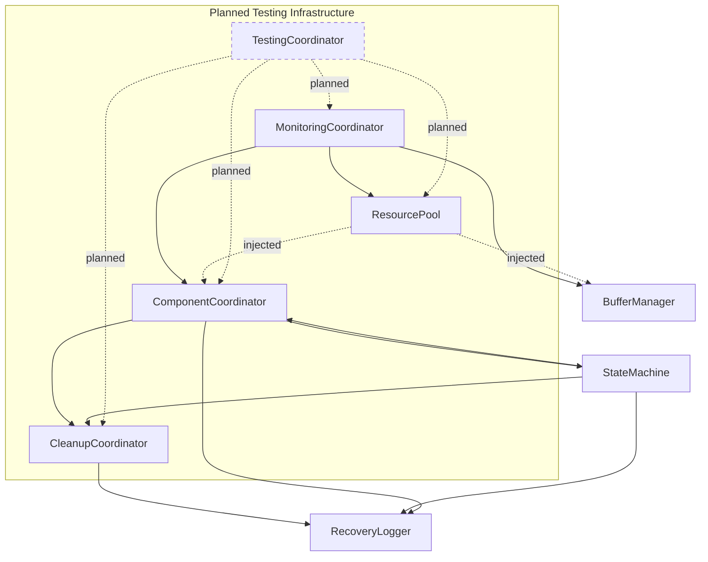

# Coordinator Dependencies Analysis

## 1. Core Architecture Overview

### 1.1 Current Architecture Issues (2025-02-20)

#### Circular Dependencies
- MonitoringCoordinator ↔ ComponentCoordinator bidirectional dependency
- Resource management mixed with monitoring responsibilities
- No clear separation between monitoring and coordination interfaces
- Component state management tightly coupled with resource management
- TestingCoordinator introduces potential new circular dependencies with MonitoringCoordinator
- Cleanup operations span multiple coordinators without clear ownership

#### Core Issues

#### Core Issues
1. State Management
   - Component states spread across multiple coordinators
   - Complex state transition validation
   - No clear ownership of state management
   - State change notifications tightly coupled
   - StateMachine has direct dependencies on coordinators
   - Recovery states tightly coupled with buffer management
   - Channel-specific states increase complexity
   - Resource validation mixed with state transitions
   - Test states not properly integrated with component states
   - Async state transitions not fully handled
   - State rollback during test failures needs coordination
   - Lock acquisition order during state transitions not verified

2. Resource Management
   - Mixed responsibilities between coordinators
   - Complex allocation/deallocation paths
   - Resource tracking spread across components
   - No centralized resource lifecycle
   - Test resource cleanup not properly integrated
   - Memory pool fragmentation during long test runs
   - Resource limits not enforced across test boundaries
   - Temporary test file management not standardized
   - Resource leak detection needs improvement

3. Error Handling
   - Error propagation paths unclear
   - Recovery procedures span multiple coordinators
   - Complex error state management
   - Inconsistent error reporting
   - Test failures not properly distinguished from system errors
   - Error context loss during async operations
   - Recovery procedures not verified in test scenarios
   - Error injection mechanisms not standardized
   - Thread failure handling incomplete

4. Testing Challenges
   - Components must be tested with real system interactions
   - No mocking allowed (except Whisper API during development)
   - Circular dependencies require real component instantiation
   - State verification must use actual state changes
   - Hardware dependencies require real device testing
   - Test environment setup/teardown not atomic
   - Resource cleanup between tests unreliable
   - Test isolation not guaranteed
   - Performance impact of real device tests
   - Test data generation not standardized
   - Hardware test lab requirements not specified
   - Long-running test stability issues
   - Test result aggregation incomplete

### 1.2 Recent Changes (2025-02-18/19)
- Lock Hierarchy Established:
  * Current order: state -> metrics -> perf -> component -> update
  * Must be preserved in interface implementations
  * Affects all component interactions
- State Management Evolution:
  * Channel-specific states implemented
  * Rollback mechanisms in place
  * Performance tracking integrated
- Resource Management Progress:
  * Tier-aware buffer optimization active
  * ResourcePool integration complete
  * Channel-specific queues implemented

## 2. Core Coordinator Analysis

### 2.1 Monitoring Coordinator
1. Current Dependencies
   - Direct dependencies on multiple core components:
     * ComponentCoordinator for state management
     * BufferManager for resource operations
     * ResourcePool for resource allocation
     * PySide6.QtCore for GUI signal handling
   - Complex lock hierarchy implementation:
     * State lock (RLock)
     * Metrics lock
     * Performance lock
     * Thread management locks
     * Component operation locks

2. Resource Management Issues
   - Complex resource pool configuration
   - Mixed responsibilities:
     * Buffer allocation/deallocation
     * Thread lifecycle management
     * Performance tracking
     * State coordination
   - Resource cleanup during shutdown
   - Channel-specific resource tracking

3. State Management Issues
   - Complex state transition handling
   - Error state propagation
   - Channel-specific state tracking
   - Thread state management
   - Component lifecycle coordination

4. Error Handling
   - Multi-level error tracking
   - Channel-aware error handling
   - Thread failure management
   - Error context preservation
   - Complex recovery procedures

5. Performance Tracking
   - Detailed metrics collection
   - Channel-specific metrics
   - Performance history management
   - Resource usage monitoring
   - Thread health tracking

### 2.2 Component Coordinator
1. Current Dependencies
   - Required MonitoringCoordinator in constructor
   - Complex state machine integration
   - Thread monitoring system
   - Lock hierarchy management:
     * Component operations
     * Resource operations
     * History operations
     * Callback operations
     * Thread monitoring

2. Resource Management Issues
   - Complex resource allocation tracking
   - Channel-specific buffer management
   - Mixed resource type handling
   - Component lifecycle management
   - Resource limit enforcement

3. State Management Issues
   - Complex state transition validation
   - State history tracking
   - Component state rollback
   - Thread state monitoring
   - Callback notification system

4. Error Handling
   - Thread failure management
   - Component error propagation
   - State transition errors
   - Resource allocation failures
   - Cleanup error handling

### 2.3 Testing Coordinator
1. Core Responsibilities
   - Test environment management
   - Real component interaction validation
   - Lock hierarchy enforcement
   - Resource cleanup coordination
   - Test result organization
   - Performance analysis

2. Dependencies
   - Direct MonitoringCoordinator dependency
   - ComponentCoordinator for state validation
   - ResourcePool for test resources
   - CleanupCoordinator for test cleanup
   - Lock hierarchy compliance:
     * State lock (RLock)
     * Metrics lock
     * Performance lock
     * Component lock
     * Update lock

3. Resource Management
   - Test environment setup/teardown
   - Real component allocation
   - Test file management
   - Result directory organization
   - Resource usage monitoring

4. State Management
   - Test state tracking
   - Component state validation
   - Lock state verification
   - Thread health monitoring
   - Error state handling

5. Implementation Example
```python
class TestingCoordinator:
    """Coordinator for managing test execution and validation."""
    
    def __init__(
        self,
        monitoring_coordinator: MonitoringCoordinator,
        component_coordinator: ComponentCoordinator,
        cleanup_coordinator: CleanupCoordinator
    ):
        self.monitoring = monitoring_coordinator
        self.component = component_coordinator
        self.cleanup = cleanup_coordinator
        self.locks = self._create_lock_hierarchy()
        self.test_env = TestEnvironment()
        
    def _create_lock_hierarchy(self) -> Dict[str, threading.RLock]:
        """Create locks following hierarchy: state -> metrics -> perf -> component -> update"""
        return {
            "state": threading.RLock(),
            "metrics": threading.RLock(),
            "perf": threading.RLock(),
            "component": threading.RLock(),
            "update": threading.RLock()
        }
        
    async def setup_test_environment(self) -> None:
        """Initialize test environment with real components."""
        with self.locks["state"]:
            self.test_env.initialize_managers()
            
        with self.locks["metrics"], self.locks["perf"]:
            await self._verify_system_health()
            
    async def run_component_test(
        self,
        component: str,
        test_data: bytes,
        expected_state: ComponentState
    ) -> None:
        """Execute component test with proper lock management."""
        thread_id = self.monitoring.register_thread()
        try:
            with self.locks["state"]:
                current_state = self.component.get_component_state(component)
                if current_state != ComponentState.INITIALIZED:
                    raise TestError(f"Invalid initial state: {current_state}")
            
            with self.locks["metrics"], self.locks["perf"]:
                # Process test data with real component
                for channel in ["left", "right"]:
                    with self.locks["component"]:
                        result = await self._process_channel(component, channel, test_data)
                        
                    with self.locks["update"]:
                        self._update_test_metrics(component, channel, result)
                        
            # Verify final state
            with self.locks["state"]:
                final_state = self.component.get_component_state(component)
                if final_state != expected_state:
                    raise TestError(f"Invalid final state: {final_state}")
                    
        except Exception as e:
            self._handle_test_error(e, thread_id)
        finally:
            self.monitoring.unregister_thread(thread_id)
            
    async def cleanup_test_environment(self) -> None:
        """Cleanup test environment in reverse dependency order."""
        try:
            with (
                self.locks["state"],
                self.locks["metrics"],
                self.locks["perf"],
                self.locks["component"],
                self.locks["update"]
            ):
                await self.test_env.cleanup_managers()
                self._verify_resource_cleanup()
                
        except Exception as e:
            raise TestError(f"Cleanup failed: {e}")
            
    def _handle_test_error(self, error: Exception, thread_id: int) -> None:
        """Handle test errors with proper context preservation."""
        error_context = {
            "thread_id": thread_id,
            "thread_health": self.monitoring.get_thread_health(thread_id),
            "system_health": self.monitoring.verify_system_health(),
            "lock_state": self._get_lock_state()
        }
        raise TestError(f"Test failed: {error}\nContext: {error_context}")
        
    def _verify_resource_cleanup(self) -> None:
        """Verify all test resources are properly cleaned up."""
        resources = self.monitoring.get_resource_usage()
        if resources["allocated_count"] > 0:
            raise TestError(f"Resource leak detected: {resources}")
            
    async def _verify_system_health(self) -> None:
        """Verify system health before test execution."""
        health = await self.monitoring.verify_system_health()
        if not health["status"] == "healthy":
            raise TestError(f"Unhealthy system state: {health}")
            
    def _get_lock_state(self) -> Dict[str, bool]:
        """Get current lock state for all managed locks."""
        return {name: lock.locked() for name, lock in self.locks.items()}
```

### 2.4 Cleanup Coordinator
1. State Integration
   - Direct dependency on StateMachine
   - Maps cleanup phases to recovery states
   - Complex state transition validation
   - Tightly coupled phase/state mapping
   - Requires monitoring coordinator for error handling

2. Cleanup Management
   - Ordered cleanup with dependency tracking
   - Complex step validation and verification
   - Async and sync cleanup operations
   - Multi-phase cleanup process
   - Resource cleanup coordination

3. Lock Management
   - Complex lock hierarchy (4 levels)
   - Lock ordering matches MonitoringCoordinator
   - Multiple critical sections
   - Potential deadlock scenarios
   - Cleanup requires multiple locks

4. Error Handling
   - Step failure propagation
   - Dependent step failure tracking
   - Error context preservation
   - Recovery state coordination
   - Complex error reporting chain

## 3. Resource Management Components

### 3.1 Buffer Manager
1. Queue Management
   - Channel-specific queues (left/right) increase complexity
   - Queue metrics tightly coupled with monitoring
   - Buffer allocation through coordinator
   - Complex cleanup coordination
   - Performance tracking mixed with buffer operations
   - Test data queues not isolated
   - Queue state verification incomplete
   - Buffer overflow during long tests
   - Channel synchronization issues
   - Missing queue health metrics

2. Lock Hierarchy
   - Multiple lock types for different operations
   - Lock ordering matches MonitoringCoordinator
   - Complex lock acquisition patterns
   - Potential deadlock scenarios
   - Cleanup requires multiple locks
   - Test-specific lock timeouts needed
   - Lock contention during parallel tests
   - Missing deadlock detection
   - Lock state verification gaps
   - Recovery lock handling incomplete

3. Resource Management
   - Buffer pools managed through coordinator
   - Resource limits checked through coordinator
   - Complex allocation/deallocation paths
   - Channel-aware resource tracking
   - Performance impact from validation chains
   - Test buffer isolation missing
   - Resource limit verification gaps
   - Memory fragmentation in test pools
   - Buffer lifecycle tracking issues
   - Resource leak detection needed

4. Error Handling
   - Error context preserved across operations
   - Complex rollback procedures
   - Multi-component error propagation
   - Channel-specific error tracking
   - Recovery requires coordinator interaction
   - Test failure isolation needed
   - Error state corruption issues
   - Incomplete cleanup after failures
   - Missing error context in tests
   - Recovery verification gaps

5. Test Integration (Planned)
   - Dedicated test buffer pools
   - Isolated test queues per component
   - Resource limit enforcement
   - Lock timeout configuration
   - Error context preservation
   - State verification mechanisms
   - Performance impact monitoring
   - Cleanup verification
   - Memory leak detection
   - Queue health tracking

### 3.2 Resource Pool
1. Current Dependencies
   - Direct MonitoringCoordinator constructor dependency
   - Extensive coordinator integration for metrics/errors
   - Follows coordinator's lock hierarchy
   - Heavy reliance on coordinator state updates
   - Potential circular dependency with planned TestingCoordinator

2. Resource Management Issues
   - Mixed responsibilities with monitoring
   - Complex allocation/tracking paths
   - No clear resource lifecycle ownership
   - Performance impact from validation chains
   - Tightly coupled cleanup procedures
   - Resource pool fragmentation during long test runs
   - Memory leaks during test failures
   - Resource limits not enforced across test boundaries
   - No standardized cleanup for test resources
   - Missing resource usage tracking per test

3. Metrics and State Issues
   - Metrics collection mixed with core logic
   - Complex state update procedures
   - No clear metrics ownership
   - Performance tracking tightly coupled
   - State transitions span components
   - Test-specific metrics not isolated
   - Resource state verification incomplete
   - Missing performance impact tracking
   - No clear test resource boundaries
   - State corruption during test failures

4. Error Handling Challenges
   - Complex error propagation paths
   - Multi-component error handling
   - Recovery procedures span systems
   - No clear error ownership
   - Mixed cleanup and error states
   - Test failures not properly isolated
   - Resource leaks during error recovery
   - Incomplete cleanup after test failures
   - Error context loss during cleanup
   - No clear distinction between test and system errors

5. Test Resource Management (Planned)
   - Dedicated test resource pools needed
   - Isolation between test runs required
   - Resource usage tracking per test
   - Cleanup verification mechanisms
   - Performance impact monitoring
   - Memory fragmentation handling
   - Resource limit enforcement
   - State corruption prevention
   - Error recovery procedures
   - Metrics collection isolation

### 3.3 Storage Manager
1. Current Dependencies
   - Direct MonitoringCoordinator dependency in constructor
   - StateMachine obtained through coordinator
   - RecoveryState enum from coordinator
   - Resource pool integration for buffers
   - Complex coordinator integration for:
     * Error handling
     * State management
     * Resource allocation
     * Performance tracking
     * Lock hierarchy

2. Resource Management Issues
   - Write buffers managed through coordinator
   - Complex buffer lifecycle tracking
   - Mixed buffer and state management
   - Performance impact from validation
   - No clear resource ownership

3. State Management Challenges
   - Complex state transition logic
   - State machine callback system
   - Recovery states tightly coupled
   - Mixed state and error handling
   - Coordinator-dependent state updates

4. Error Handling Complexity
   - Multiple error propagation paths
   - Complex recovery procedures
   - Emergency backup protocol
   - Mixed error and state handling
   - Coordinator-dependent error reporting

5. Implementation Impact
   - Needs interface-based constructor injection
   - Should implement IResourceManager interface
   - Requires separation of:
     * Resource management from I/O operations
     * State management from core logic
     * Error handling through dedicated interface
     * Performance tracking from storage operations

## 4. Processing Components

### 4.1 Signal Processor
1. Current Dependencies
   - Direct MonitoringCoordinator dependency in constructor
   - Optional Transcriber dependency
   - Complex resource allocation through coordinator
   - Heavy reliance on coordinator for:
     * Resource management
     * Error handling
     * Performance tracking
     * State updates
     * Lock management

2. Resource Management Issues
   - Buffer allocation/deallocation through coordinator
   - Complex memory management with multiple thresholds
   - Tiered cleanup system (emergency/hard/soft/gc)
   - Performance impact from validation chains
   - No clear separation of resource concerns

3. Performance Monitoring
   - Tightly coupled metrics collection
   - Complex state tracking across components
   - Mixed responsibilities in monitoring
   - Direct coordinator updates for all metrics
   - No clear metrics ownership

4. Error Handling Challenges
   - Complex error propagation paths
   - Multiple fallback mechanisms
   - Recovery procedures span components
   - Mixed error and state management
   - Coordinator-dependent error reporting

5. Implementation Impact
   - Needs interface-based constructor injection
   - Should implement IResourceManager interface
   - Requires separation of:
     * Resource management from processing logic
     * Metrics collection from core operations
     * Error handling through dedicated interface
     * State management from processing operations

### 4.2 Audio Capture
1. Current Dependencies
   - Direct MonitoringCoordinator dependency in constructor
   - Gets BufferManager through coordinator
   - Gets WASAPIMonitor through coordinator
   - Complex coordinator integration for:
     * Device management
     * Error handling
     * State updates
     * Performance tracking
     * Buffer health monitoring

2. Resource Management Issues
   - Buffer operations through multiple managers
   - Complex channel separation handling
   - Mixed buffer and device management
   - Performance impact from health checks
   - No clear ownership of device resources

3. State Management Issues
   - Device states spread across components
   - Complex stream health tracking
   - Mixed buffer and stream states
   - Recovery state management
   - Channel-specific state tracking

4. Error Handling
   - Multiple error propagation paths
   - Complex device failure recovery
   - Mixed stream and buffer errors
   - Channel-specific error handling
   - Device change error management

### 4.3 Speaker Isolation
1. Current Dependencies
   - Optional MonitoringCoordinator in constructor
   - Heavy resource allocation through coordinator
   - Complex buffer management for:
     * Channel separation
     * Speech segments
     * FFT processing
     * Speaker profiles
   - Thread registration/cleanup integration

2. Resource Management Issues
   - Multiple buffer allocations per operation
   - Complex cleanup requirements
   - Mixed buffer and profile management
   - No clear ownership of FFT resources
   - Manual resource release patterns

3. State Management Issues
   - Speaker profiles spread across instances
   - Complex segment state tracking
   - No clear profile ownership
   - Mixed buffer and profile states
   - Thread state management

4. Error Handling
   - Multiple error propagation paths
   - Complex resource cleanup on errors
   - Mixed profile and buffer errors
   - Channel-specific error handling
   - FFT processing error management

### 4.4 Whisper Transcriber
1. Current Dependencies
   - Required MonitoringCoordinator in constructor
   - Direct SpeakerIsolation dependency
   - External OpenAI API integration
   - Complex coordinator integration for:
     * Error handling
     * Resource management
     * Performance tracking
     * Speaker tracking

2. Resource Management Issues
   - Mixed API and local resource handling
   - Complex speaker history management
   - No clear cleanup procedures
   - Rate limiting state management
   - Memory management for histories

3. State Management Issues
   - Complex initialization states
   - Mixed API and local states
   - Speaker profile coordination
   - Error state tracking
   - Performance state management

4. Error Handling
   - Multiple error propagation paths
   - Complex API error handling
   - Mixed local and API errors
   - Consecutive error tracking
   - Rate limit error management

## 5. Support Components

### 5.1 Alert System
1. Current Dependencies
   - Tightly coupled to MonitoringCoordinator for:
     * System metrics collection
     * Thread registration and lifecycle
     * Component locking mechanisms
     * Error handling and propagation
     * Alert suppression logic
     * Performance tracking
   - Complex state management across coordinators
   - Intertwined resource and monitoring operations

### 5.2 System Verifier
1. Current Dependencies
   - Direct MonitoringCoordinator instantiation
   - Direct dependencies on multiple components:
     * WASAPIMonitor
     * CleanupCoordinator
     * RecoveryLogger
     * StateMachine
     * StorageManager
     * DeviceManager
   - Complex initialization chain
   - Potential circular dependency with planned TestingCoordinator

2. Resource Management Issues
   - Multiple component lifecycles
   - Mixed verification responsibilities
   - No clear cleanup ordering
   - Test file management
   - Device resource handling
   - Test environment isolation missing
   - Resource limit verification gaps
   - Hardware resource tracking incomplete
   - Test data persistence issues
   - Cleanup verification needed

3. State Management Issues
   - Complex state verification
   - Mixed component states
   - Recovery state tracking
   - Test result management
   - Device state validation
   - Test state corruption handling
   - State transition verification
   - Recovery state coordination
   - Test boundary state issues
   - Hardware state verification

4. Error Handling
   - Multiple component error paths
   - Complex recovery verification
   - Mixed error reporting
   - Test failure management
   - Device error handling
   - Test error isolation needed
   - Error context preservation
   - Recovery procedure validation
   - Hardware error simulation
   - Test failure analysis

5. Test Environment Management (Planned)
   - Hardware test lab setup
   - Resource isolation mechanisms
   - State verification procedures
   - Error injection framework
   - Performance monitoring
   - Test data generation
   - Result aggregation
   - Environment cleanup
   - Hardware simulation
   - Test metrics collection

### 5.3 WASAPI Monitor
1. Current Dependencies
   - Required MonitoringCoordinator in constructor
   - Direct StateMachine dependency
   - Complex coordinator integration for:
     * Thread registration
     * State management
     * Error handling
     * Buffer management
     * Resource cleanup

2. Resource Management Issues
   - Complex stream lifecycle management
   - Multiple lock hierarchies
   - Mixed device and stream handling
   - PyAudio resource management
   - Buffer allocation coordination

3. State Management Issues
   - Complex state machine integration
   - Device state tracking
   - Stream health monitoring
   - Recovery state coordination
   - Callback state management

4. Error Handling
   - Multi-level recovery system
   - Complex device error handling
   - Stream failure recovery
   - Circuit breaker pattern
   - Buffer health monitoring

### 5.4 Windows Manager
1. Current Dependencies
   - Minimal external dependencies
   - Direct RecoveryLogger integration
   - Windows API integrations:
     * Registry access
     * Service management
     * Process control
     * MMCSS configuration
   - Complex fallback system

2. Resource Management Issues
   - Service cache management
   - Process priority handling
   - MMCSS resource control
   - API fallback resources
   - No clear cleanup patterns

3. State Management Issues
   - Version state tracking
   - API compatibility states
   - Service status tracking
   - Fallback state management
   - Error state handling

4. Error Handling
   - Multiple fallback mechanisms
   - Service access errors
   - API compatibility errors
   - MMCSS configuration errors
   - Windows version detection errors

### 5.5 Recovery Logger
1. Current Dependencies
   - Minimal external dependencies:
     * aiofiles for async I/O
     * psutil for system metrics
     * statistics for analytics
     * json for data serialization
   - File system integration:
     * Log directory structure
     * Analytics storage
     * Debug information
     * Session management
   - Planned TestingCoordinator integration

2. Resource Management
   - Async file I/O operations
   - Log file lifecycle management
   - Analytics cache handling
   - Session state tracking
   - System resource monitoring
   - Test result persistence
   - Log file isolation per test
   - Resource usage tracking
   - Cleanup coordination
   - Storage optimization

3. State Management
   - Recovery attempt tracking
   - Session lifecycle handling
   - State transition analysis
   - System state capture
   - Analytics state management
   - Test state persistence
   - Recovery state validation
   - State history tracking
   - Test boundary handling
   - State corruption prevention

4. Error Handling
   - File operation error handling
   - Analytics calculation fallbacks
   - System state capture errors
   - Log cleanup error management
   - Session state validation
   - Test failure logging
   - Error context preservation
   - Recovery verification
   - Error pattern analysis
   - Failure prediction

5. Performance Considerations
   - Async I/O for minimal blocking
   - Efficient analytics caching
   - Optimized log rotation
   - Resource usage tracking
   - Statistical analysis optimization
   - Test impact monitoring
   - Performance regression detection
   - Resource consumption analysis
   - Long-term trend tracking
   - Hardware utilization metrics

6. Test Integration (Planned)
   - Test result aggregation
   - Performance analysis
   - Error pattern detection
   - Resource usage tracking
   - State transition validation
   - Recovery success rates
   - Test coverage metrics
   - Hardware compatibility
   - System stability analysis
   - Long-term reliability tracking

## 6. Application Components

### 6.1 Audio Transcriber
1. Current Dependencies
   - Direct MonitoringCoordinator instantiation
   - Direct CleanupCoordinator instantiation
   - Multiple component dependencies:
     * WindowsManager
     * AdaptiveAudioCapture
     * SignalProcessor
     * StorageManager
     * WhisperTranscriber
   - Complex initialization chain

2. Resource Management Issues
   - Multiple component lifecycle management
   - Complex resource limit tracking
   - Mixed cleanup responsibilities
   - Performance stats management
   - Directory structure handling

3. State Management Issues
   - Complex system health tracking
   - Multi-component state coordination
   - Recovery state management
   - Initialization state handling
   - Cleanup state tracking

4. Error Handling
   - Multi-level recovery system
   - Complex rollback procedures
   - Component-specific error handling
   - Resource limit violations
   - Coordinated cleanup on errors

### 6.2 Main Application
1. Current Dependencies
   - Core system initialization:
     * MonitoringCoordinator
     * AlertSystem with AlertConfig
     * StorageManager
     * WhisperTranscriber
     * BufferManager
     * WASAPIMonitor
     * AudioCapture
     * SignalProcessor
   - GUI components:
     * PySide6 QApplication
     * MainWindow
     * QTimer for monitoring
   - Planned test infrastructure:
     * TestingCoordinator
     * TestEnvironment
     * TestExecution
     * TestMetrics
     * TestResults

2. Initialization Management
   - Complex component initialization order
   - Circular dependency resolution
   - Async initialization chain
   - Component registration sequence
   - Mock configuration handling
   - Test environment setup
   - Resource isolation
   - State verification
   - Hardware detection
   - Performance baseline

3. Resource Management
   - Working directory configuration
   - Component lifecycle tracking
   - Proper cleanup sequence
   - Lock hierarchy preservation
   - Resource release coordination
   - Test resource isolation
   - Memory pool management
   - File handle tracking
   - Hardware resource allocation
   - Performance monitoring

4. Error Handling
   - Multi-level error reporting
   - Component-specific cleanup
   - Initialization failure handling
   - Fatal error management
   - Coordinator error integration
   - Test failure isolation
   - Error context preservation
   - Recovery verification
   - State rollback
   - System stability

5. Test Infrastructure Integration (Planned)
   - Test environment initialization
   - Resource isolation mechanisms
   - State verification procedures
   - Error injection framework
   - Performance monitoring
   - Test data generation
   - Result aggregation
   - Environment cleanup
   - Hardware simulation
   - Test metrics collection

## 7. Interface Definitions

### 7.1 Core Management Interfaces

```python
IStateManager:
- register_component(name: str, component_type: str)
- get_component_state(component: str)
- transition_component_state(component: str, new_state: ComponentState)
- register_state_callback(callback: Callable)
- verify_state_consistency() -> bool  # Added for test validation
- get_state_history() -> List[StateEvent]  # Added for test analysis
- verify_state_rollback() -> bool  # Added for test recovery
- get_state_metrics() -> Dict[str, Any]  # Added for test analysis

IMonitoringManager:
- start_monitoring()
- stop_monitoring()
- update_metrics(**kwargs)
- verify_system_health() -> bool
- start_test_monitoring(test_name: str) -> None  # Added for test monitoring
- stop_test_monitoring(test_name: str) -> None  # Added for test monitoring
- get_test_metrics(test_name: str) -> Dict[str, Any]  # Added for test analysis
- verify_test_health(test_name: str) -> bool  # Added for test validation

IThreadManager:
- register_thread() -> int
- unregister_thread(thread_id: Optional[int])
- handle_thread_failure(thread_id: int, thread_name: str)
- get_thread_health(thread_id: int) -> Dict[str, Any]
- register_test_thread(test_name: str) -> int  # Added for test thread management
- unregister_test_thread(test_name: str, thread_id: int) -> None  # Added for test cleanup
- verify_test_threads(test_name: str) -> bool  # Added for test validation
- get_test_thread_metrics(test_name: str) -> Dict[str, Any]  # Added for test analysis

ITestManager:  # New interface for test management
- register_test(test_name: str, test_type: str) -> None
- start_test(test_name: str) -> None
- stop_test(test_name: str) -> None
- get_test_state(test_name: str) -> TestState
- verify_test_health(test_name: str) -> bool
- get_test_metrics(test_name: str) -> Dict[str, Any]
- verify_test_cleanup(test_name: str) -> bool
- get_test_history() -> List[TestEvent]

ITestResourceManager:  # New interface for test resource management
- allocate_test_resource(test_name: str, resource_type: str, size: int) -> Any
- release_test_resource(test_name: str, resource_type: str, resource: Any) -> None
- verify_test_resources(test_name: str) -> bool
- get_test_resource_metrics(test_name: str) -> Dict[str, Any]
- cleanup_test_resources(test_name: str) -> None
- verify_resource_isolation() -> bool

ITestStateManager:  # New interface for test state management
- register_test_state(test_name: str, initial_state: TestState) -> None
- transition_test_state(test_name: str, new_state: TestState) -> bool
- get_test_state_history(test_name: str) -> List[TestStateEvent]
- verify_test_state(test_name: str) -> bool
- rollback_test_state(test_name: str) -> bool
- get_test_state_metrics(test_name: str) -> Dict[str, Any]
```

### 7.2 Resource Management Interfaces

```python
IResourceManager:
- allocate_resource(component: str, resource_type: str, size: int)
- release_resource(component: str, resource_type: str, resource: Any)
- get_allocated_count() -> int
- verify_resource_limits() -> bool  # Added for test validation
- get_resource_metrics() -> Dict[str, Any]  # Added for test analysis
- verify_resource_cleanup() -> bool  # Added for test validation
- get_resource_history() -> List[ResourceEvent]  # Added for test analysis

IBufferManager:
- put_buffer(component: str, data: bytes, timeout: float) -> bool
- get_buffer(component: str, timeout: float) -> Optional[bytes]
- get_buffer_config() -> BufferConfig
- update_buffer_config(**kwargs) -> None
- optimize_buffers() -> None
- get_performance_stats() -> Dict[str, Any]
- verify_buffer_health() -> bool  # Added for test validation
- get_buffer_metrics() -> Dict[str, Any]  # Added for test analysis
- verify_buffer_cleanup() -> bool  # Added for test validation
- get_buffer_history() -> List[BufferEvent]  # Added for test analysis

IQueueManager:
- get_queue_size(queue_name: str) -> int
- get_queue_metrics() -> Dict[str, Any]
- validate_queue_state() -> bool
- cleanup_queues() -> bool
- verify_queue_health() -> bool  # Added for test validation
- get_queue_history() -> List[QueueEvent]  # Added for test analysis
- verify_queue_cleanup() -> bool  # Added for test validation
- get_queue_metrics_history() -> List[QueueMetrics]  # Added for test analysis

ITestResourcePool:  # New interface for test resource pooling
- allocate_test_pool(test_name: str, pool_type: str, size: int) -> None
- release_test_pool(test_name: str, pool_type: str) -> None
- get_pool_metrics(test_name: str) -> Dict[str, Any]
- verify_pool_health(test_name: str) -> bool
- cleanup_test_pools() -> None
- verify_pool_isolation() -> bool
- get_pool_history() -> List[PoolEvent]

ITestBufferManager:  # New interface for test buffer management
- create_test_buffer(test_name: str, size: int) -> None
- release_test_buffer(test_name: str) -> None
- get_buffer_state(test_name: str) -> Dict[str, Any]
- verify_buffer_isolation() -> bool
- cleanup_test_buffers() -> None
- get_buffer_metrics() -> Dict[str, Any]

ITestQueueManager:  # New interface for test queue management
- create_test_queue(test_name: str, queue_type: str) -> None
- release_test_queue(test_name: str) -> None
- get_queue_state(test_name: str) -> Dict[str, Any]
- verify_queue_isolation() -> bool
- cleanup_test_queues() -> None
- get_queue_metrics() -> Dict[str, Any]
```

### 7.3 State and Cleanup Interfaces

```python
IStateMachine:
- transition_to(new_state: State) -> bool
- get_current_state() -> State
- register_state_change_callback(callback: Callable)
- validate_transition(from_state: State, to_state: State) -> bool
- get_state_history() -> List[StateEvent]
- verify_state_consistency() -> bool  # Added for test validation
- get_state_dependencies() -> Dict[State, Set[State]]  # Added for test planning
- verify_state_rollback() -> bool  # Added for test recovery
- get_state_metrics() -> Dict[str, Any]  # Added for test analysis

ICleanupManager:
- register_step(name: str, cleanup_fn: Callable, dependencies: List[str]) -> None
- execute_cleanup() -> bool
- get_cleanup_status() -> Dict[str, Any]
- get_execution_order() -> List[str]
- request_shutdown() -> None
- verify_cleanup_completion() -> bool  # Added for test validation
- get_cleanup_metrics() -> Dict[str, Any]  # Added for test analysis
- verify_resource_cleanup() -> bool  # Added for test validation
- get_cleanup_history() -> List[CleanupEvent]  # Added for test analysis

ICleanupStep:
- execute() -> bool
- verify() -> bool
- get_dependencies() -> Set[str]
- get_status() -> Dict[str, Any]
- get_execution_time() -> float  # Added for performance tracking
- get_resource_usage() -> Dict[str, Any]  # Added for resource monitoring
- verify_step_completion() -> bool  # Added for test validation
- get_step_metrics() -> Dict[str, Any]  # Added for test analysis

ITestEnvironment:  # New interface for test environment management
- initialize() -> None
- cleanup() -> None
- verify_health() -> bool
- get_metrics() -> Dict[str, Any]
- get_resource_state() -> Dict[str, Any]
- get_lock_state() -> Dict[str, bool]
- verify_cleanup() -> bool
- setup_test_resources() -> None  # Added for resource management
- cleanup_test_resources() -> None  # Added for resource cleanup
- verify_resource_isolation() -> bool  # Added for test validation
- get_environment_metrics() -> Dict[str, Any]  # Added for test analysis

ITestExecution:  # New interface for test execution management
- setup_test(test_name: str) -> None
- run_test(test_data: Any) -> None
- verify_result(expected: Any) -> bool
- cleanup_test() -> None
- get_test_metrics() -> Dict[str, Any]
- get_error_context() -> Dict[str, Any]
- verify_test_isolation() -> bool  # Added for test validation
- get_performance_metrics() -> Dict[str, Any]  # Added for test analysis
- verify_resource_cleanup() -> bool  # Added for test validation
- get_test_history() -> List[TestEvent]  # Added for test analysis

ITestResourceManager:  # New interface for test resource management
- allocate_test_resource(test_name: str, resource_type: str, size: int) -> Any
- release_test_resource(test_name: str, resource_type: str, resource: Any) -> None
- get_test_resource_usage(test_name: str) -> Dict[str, Any]
- verify_resource_limits(test_name: str) -> bool
- cleanup_test_resources(test_name: str) -> None
- get_resource_metrics() -> Dict[str, Any]
- verify_resource_isolation() -> bool
- get_resource_history() -> List[ResourceEvent]

ITestMetricsCollector:  # New interface for test metrics collection
- start_collection(test_name: str) -> None
- stop_collection(test_name: str) -> None
- record_metric(test_name: str, metric_name: str, value: Any) -> None
- get_test_metrics(test_name: str) -> Dict[str, Any]
- get_aggregated_metrics() -> Dict[str, Any]
- verify_performance_thresholds() -> bool
- get_metrics_history() -> List[MetricEvent]
- export_metrics(format: str) -> str

ITestResultAggregator:  # New interface for test result aggregation
- add_test_result(test_name: str, result: TestResult) -> None
- get_test_results() -> Dict[str, TestResult]
- get_failure_analysis() -> Dict[str, Any]
- get_coverage_report() -> Dict[str, Any]
- get_performance_summary() -> Dict[str, Any]
- export_results(format: str) -> str
- verify_test_requirements() -> bool
- get_result_history() -> List[ResultEvent]
```

## 8. Core Component Interactions

### 8.1 Dependency Flow


Note: The TestingCoordinator and its dependencies (shown with dashed lines) represent planned additions to the system. This coordinator will integrate with existing components to provide comprehensive test management while maintaining our no-mocking policy.

### 8.2 Implementation Status and Interface Integration
IMPORTANT: NO MOCKING POLICY
All components must use real system interactions. The only exception is WhisperTranscriber's OpenAI API calls during development.

Critical Components:
- audio_capture.py: Complete with real device interactions
- audio_transcriber.py: Complete with real audio processing
- buffer_manager.py: Updated with real tier-aware optimization, channel-specific queues
- signal_processor.py: Complete with real ResourcePool integration
- speaker_isolation.py: Real ResourcePool integrated
- wasapi_monitor.py: Complete with real WASAPI device handling

Support Components:
- alert_system.py: Complete with real system monitoring
- cleanup_coordinator.py: Enhanced with real state transitions and recovery
- monitoring_coordinator.py: Complete with real lock hierarchy updates
- resource_pool.py: Complete with real memory pools (4KB/64KB/1MB)

GUI Components:
- Native features in development with real-time updates

Interface Implementation:
- MonitoringCoordinator implements real IResourceManager, IMonitoringManager, IThreadManager
- ComponentCoordinator implements real IStateManager
- Each coordinator uses real system resources
- Clear separation of real component responsibilities
- Preserve existing real-time optimizations

### 8.3 Migration Considerations
- Lock hierarchy must be preserved across interface boundaries
- Channel-specific operations need explicit interface support
- Error context preservation must span multiple interfaces
- Performance tracking integration must be maintained
- Resource pool improvements must be preserved

### 8.4 Component Updates
- Update constructors to accept interfaces
- Remove direct coordinator dependencies
- Implement clean interface boundaries
- Separate resource and state management
- Maintain performance optimizations

## 9. Testing Strategy

### 9.1 Component Testing

IMPORTANT: NO MOCKING POLICY
All tests must use real components and real system interactions. The only exception is the WhisperTranscriber's OpenAI API calls during development. This ensures our tests reflect actual system behavior and catch real-world issues.

#### Component Test Base Class
```python
class ComponentTest:
    def setUp(self):
        self.logger = logging.getLogger(self.__class__.__name__)
        # Using real coordinators - no mocks
        self.monitoring_coordinator = MonitoringCoordinator()
        self.component_coordinator = ComponentCoordinator(self.monitoring_coordinator)
        self.cleanup_coordinator = CleanupCoordinator(self.monitoring_coordinator)
        self.test_coordinator = TestingCoordinator(
            self.monitoring_coordinator,
            self.component_coordinator,
            self.cleanup_coordinator
        )
        
        # Initialize test environment
        self.test_env = self.test_coordinator.create_test_environment()
        self.test_name = self.__class__.__name__
        
        # Start monitoring and register test thread
        self.monitoring_coordinator.start_monitoring()
        self.thread_id = self.monitoring_coordinator.register_test_thread(self.test_name)
        
        # Setup test resources
        self.test_env.setup_test_resources()
        self.resource_pool = self.test_coordinator.create_test_resource_pool(self.test_name)
        self.buffer_manager = self.test_coordinator.create_test_buffer_manager(self.test_name)
        self.queue_manager = self.test_coordinator.create_test_queue_manager(self.test_name)
        
        # Initialize metrics collection
        self.metrics_collector = self.test_coordinator.create_metrics_collector(self.test_name)
        self.metrics_collector.start_collection(self.test_name)
        
        # Setup error handling
        self.shutdown_event = Event()
        self.error_lock = Lock()
        
    def tearDown(self):
        try:
            # Stop test execution
            self.shutdown_event.set()
            
            # Cleanup test component if exists
            if hasattr(self, 'component'):
                self.component.cleanup()
                
            # Stop metrics collection
            self.metrics_collector.stop_collection(self.test_name)
            
            # Cleanup test resources in reverse order
            self.queue_manager.cleanup_test_queues()
            self.buffer_manager.cleanup_test_buffers()
            self.resource_pool.cleanup_test_pools()
            self.test_env.cleanup_test_resources()
            
            # Verify cleanup completion
            assert self.test_coordinator.verify_test_cleanup(self.test_name)
            
            # Unregister test thread
            self.monitoring_coordinator.unregister_test_thread(self.test_name, self.thread_id)
            
            # Stop monitoring
            self.monitoring_coordinator.stop_monitoring()
            
            # Clear coordinator references
            self.test_coordinator = None
            self.cleanup_coordinator = None
            self.component_coordinator = None
            self.monitoring_coordinator = None
            
        except Exception as e:
            self.logger.error(f"Test cleanup failed: {e}")
            raise
```

#### Test Utilities
```python
class TestUtilities:
    def create_test_audio(self, duration_ms=1000, sample_rate=44100):
        """Generate real audio data for testing."""
        samples = np.sin(2 * np.pi * 440 * np.linspace(
            0, duration_ms/1000, int(sample_rate * duration_ms/1000)))
        return (samples * 32767).astype(np.int16).tobytes()
        
    def verify_metrics(self, metrics):
        """Validate real component metrics."""
        self.assertIsInstance(metrics, dict)
        self.assertIn('timestamp', metrics)
        self.assertIn('component_health', metrics)
        self.assertIn('resource_usage', metrics)
        self.assertIn('performance_stats', metrics)
```

#### Test Execution Example
```python
class AudioCaptureTest(ComponentTest):
    def setUp(self):
        super().setUp()
        self.test_utils = TestUtilities()
        # Using real WASAPI monitor - no mocks
        self.wasapi = WASAPIMonitor()
        self.component = AudioCapture(
            coordinator=self.coordinator,
            wasapi_monitor=self.wasapi
        )
        self.test_data = self.test_utils.create_test_audio()

    def test_audio_capture_flow(self):
        """Test complete audio capture workflow with real components."""
        try:
            # Configure and start real device capture
            self.component.configure_device(device_id=0)
            self.component.start_capture()
            
            # Process real audio data
            time.sleep(0.1)  # Allow for real audio capture
            
            # Verify real metrics and state
            metrics = self.component.get_metrics()
            self.test_utils.verify_metrics(metrics)
            self.assertEqual(
                self.component.get_state(),
                ComponentState.RUNNING
            )
            
            # Verify real buffer health
            buffer_stats = self.component.get_buffer_stats()
            self.assertGreater(buffer_stats['buffer_health'], 90)
            self.assertEqual(buffer_stats['overruns'], 0)
            
        except Exception as e:
            self.logger.error(f"Audio capture test failed: {e}")
            raise
        finally:
            self.component.stop_capture()

    def tearDown(self):
        if hasattr(self, 'component'):
            self.component.stop_capture()
        super().tearDown()
```

Key Testing Requirements:
- All tests must use real components - NO MOCKING (except Whisper API calls during development)
- Integration tests with actual system interactions
- Performance benchmarks with real operations
- Error handling verification with real error conditions
- Lock hierarchy compliance testing with real locks
- Resource cleanup verification with real resources
- State transition validation with real state changes

### 9.2 System Testing

IMPORTANT: NO MOCKING POLICY
System tests must use real system components and actual hardware interactions. The only permitted mock is the WhisperTranscriber's OpenAI API calls during development phase. This ensures our system tests catch real-world issues and validate actual system behavior.

#### Error Handling Infrastructure
- Comprehensive error context capture
  * Stack trace preservation
  * Component state at failure
  * Resource allocation status
  * Thread registration status
  * Lock state information

#### Thread Management
- Thread registration and tracking
  * Thread health monitoring
  * Resource allocation tracking
  * Lock acquisition history
  * State transition logging
  * Performance metrics collection

#### Resource Management
- Cleanup procedures
  * Ordered resource release
  * Lock hierarchy preservation
  * State rollback mechanisms
  * Error state handling
  * Recovery validation

#### System Level Tests
- End-to-end workflow validation
- Concurrent operation stress testing
- Error recovery scenarios
- Performance profiling
- Resource leak detection
- State consistency verification
- Channel synchronization testing

## 10. Benefits and Risks

### 10.1 Benefits
1. Architectural Improvements:
   - Clear separation of concerns
   - Reduced coupling between components
   - Improved testability
   - Better error handling
   - Cleaner state management
   - Explicit channel-aware operations
   - Centralized thread management
   - Unified error context preservation

2. Operational Benefits:
   - Easier debugging
   - Simplified testing
   - Better error recovery
   - Clearer component boundaries
   - Improved maintainability

3. Development Benefits:
   - Easier to implement new features
   - Reduced risk of regressions
   - Better code organization
   - Clearer dependency paths
   - Improved documentation

### 10.2 Risks and Mitigation
1. Migration Risks:
   - Breaking changes to component interactions
   - Potential performance impact
   - Testing with real components (no mocks)
   - Resource cleanup challenges
   - Lock ordering violations
   - State transition atomicity
   - Error propagation complexity
   - Channel synchronization issues
   - Hardware dependency management
   - Real-time processing requirements

2. Mitigation Strategies:
   - Phased interface implementation
   - Comprehensive testing with real components
   - Performance monitoring on actual hardware
   - Detailed documentation of real system interactions
   - Careful cleanup validation with real resources
   - Lock hierarchy preservation in real scenarios
   - Atomic operation guarantees with real state
   - Channel-aware testing with real audio
   - Error handling verification with real errors
   - Hardware test lab for all scenarios

## 11. Next Steps

1. Implementation Order:
   - Create coordinator interfaces
   - Update core components
   - Implement real component tests (no mocks)
   - Update existing tests to use real components
   - Verify real component interactions
   - Set up hardware test environment

2. Validation Requirements:
   - Full test coverage with real components
   - Performance benchmarks on actual hardware
   - Error handling verification with real errors
   - State transition validation in real scenarios
   - Resource cleanup confirmation with real resources
   - Hardware compatibility verification
   - Real-time processing validation
   - Exception handling with real system errors

3. Testing Policy Updates:
   - Remove all mocking frameworks
   - Implement real component testing
   - Set up dedicated hardware test lab
   - Document real system test procedures
   - Exception: WhisperTranscriber API calls during development
