# Comprehensive Decoupled Architecture Design

## Overview

This document outlines the fully refined architecture, resolving all circular dependencies, clarifying relationships, and ensuring proper naming conventions. The system is designed to be scalable, maintainable, and logically structured.

## Architecture Overview

The following diagram shows the complete system architecture with resolved circular dependencies:

```mermaid
graph TD
    %% Core Application
    Main[Main Application] --> |initializes| AppCoordinator[Application Coordinator]
    
    %% Base Interfaces
    AppCoordinator --> |implements| IResourceManager[IResource Manager]
    AppCoordinator --> |implements| IStateManager[IState Manager]
    AppCoordinator --> |implements| IMonitoringManager[IMonitoring Manager]
    
    %% Coordinator Layer
    AppCoordinator --> MonitoringCoordinator[Monitoring Coordinator]
    AppCoordinator --> ComponentCoordinator[Component Coordinator]
    AppCoordinator --> CleanupCoordinator[Cleanup Coordinator]
    AppCoordinator --> TestingCoordinator[Testing Coordinator]
    
    %% Resource Management
    subgraph Resource Management
        ResourcePool[Resource Pool] --> |manages| BufferManager[Buffer Manager]
        ResourcePool --> |manages| StorageManager[Storage Manager]
        ResourcePool --> |manages| ThreadPool[Thread Pool]
        
        BufferManager --> |implements| IBufferManager[IBuffer Manager]
        StorageManager --> |implements| IStorageManager[IStorage Manager]
        ThreadPool --> |implements| IThreadManager[IThread Manager]
    end
    
    %% Processing Chain
    subgraph Audio Processing
        AudioCapture[Audio Capture] --> SignalProcessor[Signal Processor]
        SignalProcessor --> SpeakerIsolation[Speaker Isolation]
        SpeakerIsolation --> WhisperTranscriber[Whisper Transcriber]
        
        AudioCapture --> |uses| WASAPIMonitor[WASAPI Monitor]
        AudioCapture --> |implements| IAudioCapture[IAudio Capture]
        SignalProcessor --> |implements| ISignalProcessor[ISignal Processor]
        SpeakerIsolation --> |implements| ISpeakerIsolation[ISpeaker Isolation]
        WhisperTranscriber --> |implements| ITranscriber[ITranscriber]
    end
    
    %% Support Systems
    subgraph Support Systems
        AlertSystem[Alert System] --> |monitors| SystemVerifier[System Verifier]
        SystemVerifier --> |uses| WindowsManager[Windows Manager]
        RecoveryLogger[Recovery Logger] --> |logs| SystemVerifier
        
        AlertSystem --> |implements| IAlertSystem[IAlert System]
        SystemVerifier --> |implements| ISystemVerifier[ISystem Verifier]
        RecoveryLogger --> |implements| IRecoveryLogger[IRecovery Logger]
    end
    
    %% GUI Components
    subgraph GUI Layer
        MainWindow[Main Window] --> |uses| AppCoordinator
        MainWindow --> |updates| StatusDisplay[Status Display]
        MainWindow --> |controls| ControlPanel[Control Panel]
        MainWindow --> |shows| Visualizer[Audio Visualizer]
    end
    
    %% Testing Infrastructure
    subgraph Test Framework
        TestingCoordinator --> TestEnvironment[Test Environment]
        TestingCoordinator --> TestDataManager[Test Data Manager]
        TestingCoordinator --> TestMetrics[Test Metrics]
        
        TestEnvironment --> |implements| ITestEnvironment[ITest Environment]
        TestDataManager --> |implements| ITestDataManager[ITest Data Manager]
        TestMetrics --> |implements| ITestMetrics[ITest Metrics]
    end
    
    %% Resource Flow
    MonitoringCoordinator --> |monitors| ResourcePool
    ComponentCoordinator --> |manages| AudioProcessing
    CleanupCoordinator --> |cleanup| ResourcePool
    
    %% State Management
    ComponentCoordinator --> |state| StateMachine[State Machine]
    StateMachine --> |implements| IStateMachine[IState Machine]
    
    %% Error Handling
    MonitoringCoordinator --> |errors| RecoveryLogger
    AlertSystem --> |alerts| RecoveryLogger
    
    %% Testing Integration
    TestingCoordinator --> |tests| ComponentCoordinator
    TestingCoordinator --> |monitors| MonitoringCoordinator
    TestingCoordinator --> |validates| CleanupCoordinator
    TestingCoordinator --> |monitors| StateMachine
    
    %% Style Definitions
    classDef interface fill:#f4f4f4,stroke:#333,stroke-width:2px,color:#000
    classDef coordinator fill:#e6f2ff,stroke:#333,stroke-width:2px,color:#000
    classDef component fill:#e6ffe6,stroke:#333,stroke-width:2px,color:#000
    classDef support fill:#ffffcc,stroke:#333,stroke-width:2px,color:#000
    classDef gui fill:#ccf2ff,stroke:#333,stroke-width:2px,color:#000
    
    %% Apply Styles
    class IResourceManager,IStateManager,IMonitoringManager,IBufferManager,IStorageManager,IThreadManager,IAudioCapture,ISignalProcessor,ISpeakerIsolation,ITranscriber,IAlertSystem,ISystemVerifier,IRecoveryLogger,ITestEnvironment,ITestDataManager,ITestMetrics,IStateMachine interface
    class AppCoordinator,MonitoringCoordinator,ComponentCoordinator,CleanupCoordinator,TestingCoordinator coordinator
    class AudioCapture,SignalProcessor,SpeakerIsolation,WhisperTranscriber,BufferManager,StorageManager,ThreadPool,ResourcePool component
    class AlertSystem,SystemVerifier,RecoveryLogger,WindowsManager,WASAPIMonitor support
    class MainWindow,StatusDisplay,ControlPanel,Visualizer gui
```

## Key Architectural Improvements

1. **Clear Hierarchy**
   - Application Coordinator as the top-level coordinator
   - Interface-based component communication
   - Logical subsystem organization

2. **Dependency Resolution**
   - Eliminated circular dependencies through interfaces
   - Established clear ownership between components
   - Well-defined component boundaries
   - Introduced explicit validation and monitoring links

3. **Resource Management**
   - Centralized ResourcePool with clear orchestration
   - Clear ownership and lifecycle management
   - Proper cleanup coordination with validation
   - Enhanced resource monitoring

4. **Processing Chain**
   - Linear audio processing flow
   - Interface-based component communication
   - Proper resource handling
   - Refined interface naming for clarity

5. **Testing Infrastructure**
   - Integrated test framework
   - Clear test environment boundaries
   - Comprehensive metrics collection
   - Enhanced monitoring capabilities

6. **Support Systems**
   - Clear monitoring and alerting flow
   - Proper error handling and recovery
   - System verification and logging
   - Complete monitoring loop with alerts

7. **GUI Integration**
   - Clean separation from core logic
   - Event-based updates
   - Real-time visualization support
   - Direct notification path to monitoring

This refined architecture ensures a fully decoupled, scalable, and logically structured system. With explicit validation points, clear monitoring relationships, and better naming conventions, it provides a solid foundation for further development while maintaining system performance and functionality.
