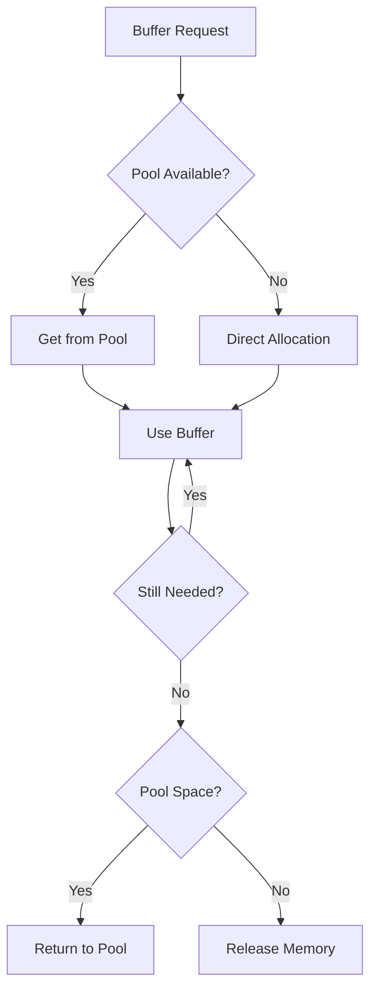
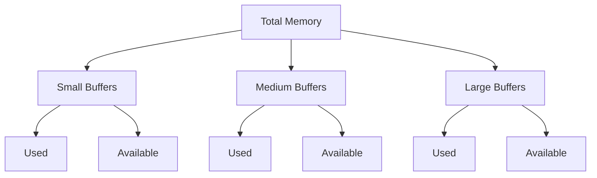

# Buffer Management System

## Allocation Policies

### Tiered Buffer Pools
- Small Buffers (≤4KB)
  - Maximum pool size: 1000 buffers
  - Ideal for short audio segments and temporary processing
  - Quick allocation and recycling

- Medium Buffers (≤64KB)
  - Maximum pool size: 500 buffers
  - Used for standard processing windows
  - Balanced between size and performance

- Large Buffers (≤1MB)
  - Maximum pool size: 100 buffers
  - Reserved for bulk operations
  - Carefully managed to prevent memory pressure

### Smart Allocation Logic
1. Size-based pool selection
2. Pool availability checking
3. Fallback to direct allocation
4. Automatic buffer resizing

## Memory Recycling Flow

### Buffer Lifecycle
1. Request Phase
   - Size determination
   - Pool selection
   - Availability check
   - Allocation decision

2. Usage Phase
   - Buffer tracking
   - Usage monitoring
   - Health checks

3. Recycling Phase
   - Cleanup verification
   - Pool return
   - Memory reclamation

### Recycling Strategy

## Cleanup Thresholds

### Memory Management
- Memory Threshold: 100MB
  - Trigger: Memory pressure detected
  - Action: Decrease buffer size to 75% of current
  - Clear unused pools

- CPU Usage Threshold: 80%
  - Trigger: High CPU load detected
  - Action: Increase buffer size to 150% of current
  - Limited by max buffer duration

### Cleanup Strategy
- Dynamic optimization based on system metrics
- Automatic adjustment of buffer sizes
- Resource pool management
- Emergency cleanup on critical pressure

## Performance Metrics

### Buffer Pool Statistics
- Allocation count
- Cache hit rate
- Total memory allocated
- Pool utilization rates
- Buffer turnover rate

### Memory Usage Metrics

### Performance Monitoring
1. Allocation Patterns
   - Request frequency
   - Size distribution
   - Pool hit rates
   - Allocation duration

2. Usage Patterns
   - Buffer lifetime
   - Reuse rate
   - Memory pressure
   - Pool efficiency

3. Cleanup Effectiveness
   - Memory recovery rate
   - Pool turnover
   - GC impact
   - Recovery time

### Health Indicators
- Pool utilization %
- Memory pressure level
- Allocation latency
- Cache hit ratio
- Cleanup frequency
- Recovery success rate

## Best Practices

### Memory Management
1. Prefer pool allocation over direct allocation
2. Return buffers promptly after use
3. Monitor pool utilization
4. Regular cleanup cycles
5. Handle memory pressure gracefully

### Performance Optimization
1. Right-size buffer pools
2. Minimize buffer copying
3. Use appropriate buffer sizes
4. Monitor allocation patterns
5. Optimize cleanup timing

### Error Handling
1. Handle pool exhaustion
2. Manage memory pressure
3. Recover from allocation failures
4. Monitor system health
5. Log significant events
